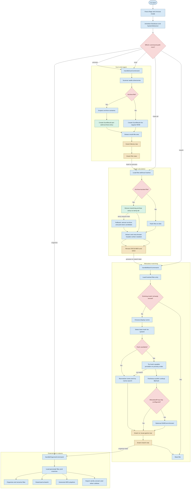

# Follow The Full Pipeline

This diagram shows the end-to-end CLI pipeline for scanning, hashing, matching, and organizing ROM files.

It reflects the current runtime flow in the CLI and core services.

Use the static PNG below if your editor does not render Mermaid.

Use [FULL-PIPELINE-DIAGRAM.mmd](FULL-PIPELINE-DIAGRAM.mmd) as the canonical source file for Mermaid-specific tooling and direct diagram preview.

Use [FULL-PIPELINE-DIAGRAM.png](FULL-PIPELINE-DIAGRAM.png) when you need the most compatible rendered image.

Use [FULL-PIPELINE-DIAGRAM.svg](FULL-PIPELINE-DIAGRAM.svg) when you need a renderer-independent version.

Related entry points:

- [../../src/cli/main.cpp](../../src/cli/main.cpp)
- [../../src/cli/cli_commands_info.cpp](../../src/cli/cli_commands_info.cpp)
- [../../src/cli/cli_commands_match.cpp](../../src/cli/cli_commands_match.cpp)
- [../../src/cli/cli_commands_organize.cpp](../../src/cli/cli_commands_organize.cpp)

```mermaid
flowchart TD
	Start([CLI start]) --> Args[Parse flags and choose mode]
	Args --> Init[Initialize Database and SystemDetector]
	Init --> Dispatch{Which command path runs?}

	subgraph Ingest[Scan and ingest]
		ScanCmd[handleScanCommand]
		Scanner[Scanner walks directories]
		ArchiveCheck{Archive file?}
		Regular[Create ScanResult for regular ROM]
		ArchiveInspect[Inspect archive contents]
		ArchiveEntry[Create ScanResult per valid archive entry]
		DetectMulti[Detect multi-file sets]
		PersistLibrary[Insert library row]
		PersistFile[Insert file rows]

		ScanCmd --> Scanner --> ArchiveCheck
		ArchiveCheck -->|No| Regular
		ArchiveCheck -->|Yes| ArchiveInspect --> ArchiveEntry
		Regular --> DetectMulti
		ArchiveEntry --> DetectMulti
		DetectMulti --> PersistLibrary --> PersistFile
	end

	subgraph Hashing[Hash calculation]
		HashPhase[Load files without hashes]
		HashDecision{Archive-backed file?}
		DirectHash[Hash file on disk]
		ExtractOne[Extract matching archive entry to temp dir]
		ExtractFallback[Fallback: extract archive and pick best candidate]
		HeaderTrim[Detect and strip known headers when needed]
		SaveHashes[Persist CRC32 MD5 and SHA1]

		HashPhase --> HashDecision
		HashDecision -->|No| DirectHash --> HeaderTrim --> SaveHashes
		HashDecision -->|Yes| ExtractOne --> HeaderTrim --> SaveHashes
		ExtractOne -->|entry extract fails| ExtractFallback --> HeaderTrim
	end

	subgraph Matching[Metadata matching]
		MatchCmd[handleMatchCommand]
		HashedOnly[Load hashed files only]
		SkipMatched{Existing match already stored?}
		DisplayName[Choose display name]
		BestHash[Select best hash for system]
		HashFirst{Hash available?}
		HashProviders[Try hash-capable providers in priority order]
		NameFallback[Normalize name and try name search]
		Hasheous[Hasheous public Lookup ByHash]
		ProxyGate{MetadataProxy key configured?}
		OptionalEnrich[Optional IGDB enrichment]
		PersistGame[Insert or reuse game row]
		PersistMatch[Insert match row]

		MatchCmd --> HashedOnly --> SkipMatched
		SkipMatched -->|Yes| NextFile[Next file]
		SkipMatched -->|No| DisplayName --> BestHash --> HashFirst
		HashFirst -->|Yes| HashProviders --> Hasheous --> ProxyGate
		ProxyGate -->|Yes| OptionalEnrich --> PersistGame --> PersistMatch
		ProxyGate -->|No| PersistGame
		HashProviders -->|no match| NameFallback --> PersistGame
		HashFirst -->|No| NameFallback
		PersistMatch --> NextFile
	end

	subgraph Outputs[Downstream outputs]
		OrganizeCmd[handleOrganizeCommand]
		ReadMatches[Load persisted files and matches]
		Organize[Organize and rename files]
		Artwork[Download artwork]
		M3U[Generate M3U playlists]
		Exports[Export verify convert and other utilities]

		OrganizeCmd --> ReadMatches --> Organize
		ReadMatches --> Artwork
		ReadMatches --> M3U
		ReadMatches --> Exports
	end

	Dispatch -->|scan| ScanCmd
	Dispatch -->|hash-all| HashPhase
	Dispatch -->|match| MatchCmd
	Dispatch -->|organize| OrganizeCmd
	Dispatch -->|process| ScanCmd

	PersistFile -->|hash or process| HashPhase
	SaveHashes -->|process or match later| MatchCmd
	PersistMatch -->|organize later| OrganizeCmd

	classDef entry fill:#d9f2e6,stroke:#3a7a5a,color:#102418
	classDef store fill:#f4e4c1,stroke:#8a6a1f,color:#2d230a
	classDef action fill:#d7e9f7,stroke:#3f6c8f,color:#0f2233
	classDef decision fill:#f8d9d9,stroke:#9b4d4d,color:#3b1111

	class Start,Args,Init,ScanCmd,Scanner,Regular,ArchiveInspect,ArchiveEntry,DetectMulti,PersistLibrary,PersistFile,HashPhase,DirectHash,ExtractOne,ExtractFallback,HeaderTrim,SaveHashes,MatchCmd,HashedOnly,DisplayName,BestHash,HashProviders,NameFallback,Hasheous,OptionalEnrich,PersistGame,PersistMatch,OrganizeCmd,ReadMatches,Organize,Artwork,M3U,Exports,NextFile action
	class PersistLibrary,PersistFile,SaveHashes,PersistGame,PersistMatch store
	class ArchiveCheck,HashDecision,SkipMatched,HashFirst,ProxyGate,Dispatch decision
	class ArchiveEntry,ExtractOne entry
```

## Read The Diagram

- The ingest stage scans the filesystem and archives, then persists file records.
- The hashing stage computes content hashes for regular files and extracted archive entries.
- The matching stage prefers hash-capable providers first, then falls back to normalized name search.
- The output stage reuses persisted matches for organize, artwork, playlist generation, and exports.

## Keep In Mind

- `--process` covers scan, hash, and match.
- `--organize` is a separate command path that runs after matches already exist.
- Archive-backed files use inner content hashes for matching and the container name for the common user-facing display case.