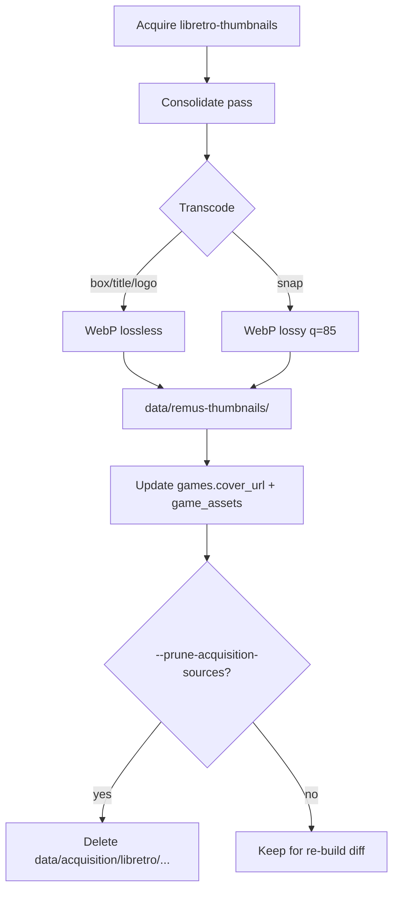

# Compendium Artwork Storage — Feasibility Study (2026-06-23)

> Companion to [compendium-offline-first-plan-2026-06-23.md](compendium-offline-first-plan-2026-06-23.md).
>
> **Question**: How should Remus handle large thumbnail/image datasets (~tens of GB)?
> Can we compress assets, delete upstream dumps after build, and/or build a dedicated
> **remus-thumbnails** library instead of mirroring libretro-thumbnails verbatim?

---

## 1. Executive summary

| Approach | Feasibility | Recommendation |
|----------|-------------|----------------|
| Store images **inside** `remus_compendium.db` | **Poor** | Do not use SQLite BLOBs for artwork |
| Store **references only** (paths/URLs) in compendium | **Current + planned** | Yes — `games.cover_url TEXT` |
| Mirror full **libretro-thumbnails** tree | **Works** | Acquisition only; not the long-term store |
| **remus-thumbnails** curated asset library | **High** | Recommended canonical store |
| **Lossless WebP** re-encode | **High** | ~25–40% savings; Qt already supports `.webp` |
| **Per-type compression** (box vs snap) | **High** | Best size/quality tradeoff |
| **Delete libretro tree after ingest** | **Conditional** | Only after copy into remus-thumbnails + path rewrite |
| **Compendium-only subset** (games in DB only) | **High** | Major savings vs full 124-system mirror |

**Bottom line:** The compendium does **not** ingest image bytes today — it stores text
references (`cover_url`) or constructs CDN URLs at runtime. A build-time **consolidation
pass** should copy matched assets into `data/remus-thumbnails/`, record repo-relative paths
in the DB, then optionally prune the libretro acquisition tree. Compression should happen
during consolidation, not in SQLite.

---

## 2. What Remus stores today

### 2.1 Compendium database (`remus_compendium.db`)

```sql
-- migration 0010
ALTER TABLE games ADD COLUMN cover_url TEXT;
```

- **Type**: `TEXT` — HTTPS URL or (planned) repo-relative file path
- **No BLOB columns** for box art, snaps, or title screens in the compendium schema
- **IGDB enrichment** writes remote URLs, e.g. `https://images.igdb.com/igdb/image/upload/...`
- **`game_facts`** can also hold `cover_url` with source provenance

`CompendiumProvider::getArtwork()` currently **ignores** `cover_url` for local files and
rebuilds libretro CDN URLs from `canonical_title` + `systems.libretro_name`.

### 2.2 User library database (separate from compendium)

- `files.has_local_artwork` flag
- Artwork files under `QStandardPaths::AppDataLocation/artwork/`
- `ArtworkDownloader` saves `.png`, `.jpg`, `.jpeg`, `.webp` (format detected after download)

### 2.3 Implication

Deleting `data/thumbnails/` (libretro mirror) **after build** is **not safe** unless the
build has already:

1. Copied (or transcoded) each matched image into **remus-thumbnails**, and
2. Updated `games.cover_url` (and runtime resolvers) to point at the new location.

Otherwise the compendium only ever held pointers into the libretro tree — or CDN URLs with
no local file at all.

---

## 3. Option A — Compression (lossless / minimal loss)

### 3.1 Format research (2024–2026)

| Format | vs PNG | Quality | Qt / Remus support | RetroArch export |
|--------|--------|---------|-------------------|------------------|
| **PNG + oxipng** | −10–18% | Identical | Universal | Native |
| **WebP lossless** | −25–40% | Bit-identical | Yes (`.webp` in artwork paths) | Needs re-export as PNG |
| **WebP lossy q=85–90** | −50–70% on photos | Artifacts on text/UI edges | Yes | Needs conversion |
| **AVIF lossless** | −15–25% | Identical | Limited in Qt | Poor interoperability |
| **JPEG XL lossless** | −30–48% | Identical | Poor browser/Qt support | Not practical yet |

Sources: [Google WebP lossless study](https://developers.google.com/speed/webp/docs/webp_lossless_alpha_study),
[lossless format comparison 2026](https://theimagecdn.com/docs/lossless-image-formats).

### 3.2 Per asset-type strategy (recommended)

Libretro defines three thumbnail classes ([docs](https://docs.libretro.com/guides/roms-playlists-thumbnails/)):

| Type | Content | Recommended encoding | Rationale |
|------|---------|---------------------|-----------|
| **Named_Boxarts** | Scanned covers, text, logos | **WebP lossless** or optimized PNG | Sharp edges; lossy causes ringing on title text |
| **Named_Titles** | Title screens, often pixel art | **WebP lossless** | Same as box art |
| **Named_Snaps** | In-game screenshots | **WebP lossy q=85** or lossless | More photographic; lossy often acceptable at UI size |
| **Named_Logos** | Flat logos | **WebP lossless** | Small files; sharp edges |

RetroArch upstream requires **PNG ≤512px wide** in the git repos; many assets are already
within spec but git history and unoptimized PNGs inflate size. Community reports:

- Full shallow git clone ≈ **12–31 GB** (monolithic era) vs **~96 GB** GitHub API estimate
  for current 124-repo layout (includes git overhead)
- MAME collection: **7.18 GB → 2.9 GB** after resize to max 256×512 + 256-color palette
  ([libretro-thumbnails#307](https://github.com/libretro/libretro-thumbnails/issues/307))
- SNES boxarts: PNG 232 MB vs JPEG 86 MB; but snaps/titles **grow** with JPEG
  ([RetroArch#3010](https://github.com/libretro/RetroArch/issues/3010))

### 3.3 Estimated savings (full catalogue)

Assuming ~96 GB raw libretro PNG mirror:

| Pipeline | Est. output | Notes |
|----------|-------------|-------|
| Copy as-is | 96 GB | Baseline |
| oxipng -o4 all PNGs | ~80 GB | Slow; keeps PNG |
| WebP lossless all | ~65–72 GB | Good default |
| **Tiered** (lossless box/title, lossy snap) | **~45–60 GB** | Best practical ratio |
| Resize oversize (>512px) + WebP lossless | Additional 10–30% | Fix non-compliant upstream assets |
| **Compendium subset only** (~180k games, 3 types) | **~15–35 GB** tiered | Skip orphan libretro files |

### 3.4 Implementation sketch

```bash
# During consolidate pass (pseudo)
cwebp -lossless -m 6 "$src.png" -o "$dest.webp"    # boxarts, titles, logos
cwebp -q 85 -m 6 "$src.png" -o "$dest.webp"         # snaps only
```

- Validate decode round-trip before deleting source PNG
- Store format in sidecar manifest or filename extension
- `ArtworkDownloader` / `QImageReader` already handle `.webp`

### 3.5 Feasibility verdict: **HIGH**

Compression during consolidation is low-risk, aligns with Remus (not RetroArch) as the
consumer, and Qt already supports WebP in the artwork pipeline.

---

## 4. Option B — Delete acquisition artefacts after ingest

### 4.1 Proposed flag

```text
--prune-acquisition-sources[=thumbnails,launchbox,hasheous,...]
--prune-acquisition-after-system   # delete each system's libretro tree after consolidate
```

### 4.2 When deletion is safe

| Prerequisite | Why |
|--------------|-----|
| Asset copied to `data/remus-thumbnails/` | Compendium paths must not reference libretro tree |
| `cover_url` / `game_assets` updated | DB points at remus-thumbnails |
| Consolidation manifest written | `data/remus-thumbnails/.manifest.json` with SHA-256 per asset |
| Optional verify pass | Decode sample or count mismatch check |

### 4.3 When deletion is **not** safe

- Compendium only stores CDN URLs (`https://thumbnails.libretro.com/...`)
- Enrichment pass skipped (no local copy made)
- Re-build planned with `--skip-update` and pruned sources gone
- Other enrichers still read from pruned tree (N/A for thumbnails if consolidated)

### 4.4 Per-system incremental prune

```text
for system in CORE_SYSTEMS:
  download libretro-thumbnails/{system}
  consolidate → data/remus-thumbnails/{system}/
  enrich compendium games for that system_id
  rm -rf data/acquisition/libretro-thumbnails/{system}/
```

**Benefit**: Peak disk = acquisition size + remus-thumbnails size for **one system at a
time**, not both full trees globally.

### 4.5 Feasibility verdict: **HIGH** (with remus-thumbnails consolidation prerequisite)

Without consolidation, pruning is **not feasible** — the compendium cannot “ingest” images
it never copied.

---

## 5. Option C — remus-thumbnails library

### 5.1 Why not keep libretro-thumbnails as the canonical store?

| libretro-thumbnails | remus-thumbnails |
|--------------------|------------------|
| 124 full system repos | Subset tied to compendium `game_id` |
| PNG-only upstream convention | WebP/PNG per Remus policy |
| Orphan files for games not in DAT | No orphans (one row → zero or more assets) |
| Git submodule maintenance | Manifest + optional attribution file |
| RetroArch path layout | Remus-optimized layout |

**Attribution** (required ethically / legally):

```text
data/remus-thumbnails/ATTRIBUTION.md
  Primary source: libretro-thumbnails (https://github.com/libretro-thumbnails)
  Credits: MobyGames, Fandom, community contributors (per upstream README)
  Remus modifications: transcoded to WebP, compendium-indexed subset
```

### 5.2 Proposed layout

**Option C1 — Mirror layout (simplest migration)**

```text
data/remus-thumbnails/
  ATTRIBUTION.md
  manifest.json              # build id, source SHAs, asset counts
  Nintendo - Game Boy Advance/
    boxarts/Super Mario Advance (USA).webp
    snaps/...
    titles/...
```

**Option C2 — Content-addressable (best dedup)**

```text
data/remus-thumbnails/
  blobs/ab/cdef1234....webp   # SHA-256 of normalized pixel data
  index.sqlite                # game_id → (box_blob, snap_blob, title_blob)
```

Dedup helps when regional variants share identical art (limited but non-zero).

**Option C3 — Compendium-native table (paths only, files external)**

```sql
CREATE TABLE game_assets (
  game_id TEXT NOT NULL,
  asset_type TEXT NOT NULL,  -- 'box' | 'snap' | 'title' | 'logo'
  storage_path TEXT NOT NULL,
  content_sha256 TEXT,
  width INTEGER,
  height INTEGER,
  mime_type TEXT,
  source_id TEXT,            -- 'libretro-thumbnails'
  source_path TEXT,          -- original libretro relative path
  PRIMARY KEY (game_id, asset_type)
);
```

`games.cover_url` remains denormalized box path for simple queries; `game_assets` holds
full set.

### 5.3 Compendium-only subset

The compendium has on the order of **~180k games** (when fully built). Libretro repos
contain files for DAT entries plus extras — consolidating **only games present in
`games`** skips orphans and reduces storage materially.

Coverage-driven copy:

```sql
SELECT g.game_id, g.canonical_title, s.libretro_name
FROM games g JOIN systems s ON ...
WHERE cover_url IS NULL OR ...
```

For each row: resolve libretro PNG candidates → transcode → write remus-thumbnails →
update DB.

### 5.4 Feasibility verdict: **HIGH** — recommended architecture

This is the right long-term model: libretro-thumbnails is an **input**, remus-thumbnails
is the **Remus artefact** (like DATs → compendium signatures).

---

## 6. What not to do

### 6.1 SQLite BLOB storage

Storing millions of images inside `remus_compendium.db`:

- Bloats backup/restore (DB already large)
- Poor mmap/cache behavior for random image reads
- Complicates partial updates per source

**Verdict: not feasible / not recommended** for this scale.

### 6.2 Delete libretro tree without remus-thumbnails

Breaks any `cover_url` or resolver path still pointing at `data/thumbnails/`.

### 6.3 Lossy compression on all asset types

Box art with small text degrades visibly under lossy WebP ([guidance](https://www.webpery.com/guides/lossy-vs-lossless)).

---

## 7. Recommended pipeline (integrated)



### Build phases (add to offline-first plan)

| Phase | Deliverable |
|-------|-------------|
| **1a** | `consolidate_libretro_thumbnails` — copy/transcode compendium-matched assets |
| **1b** | `enrichFromRemusThumbnails` — write paths to `cover_url` / `game_assets` |
| **1c** | `ThumbnailUrlHelper` — resolve remus-thumbnails before CDN |
| **2** | `--prune-acquisition-sources` + per-system incremental mode |
| **3** | `game_assets` migration + snap/title in compendium |

### CLI flags (proposed)

```text
--consolidate-thumbnails         Run transcode+copy into data/remus-thumbnails/
--prune-acquisition-sources      Remove upstream trees listed in manifest
--thumbnail-format webp|png      Default: webp
--thumbnail-snap-quality 85      Lossy quality for Named_Snaps only
--acquisition-dir data/acquisition/libretro-thumbnails  # separate from canonical store
```

---

## 8. Size scenarios (planning numbers)

| Scenario | Disk (order of magnitude) |
|----------|---------------------------|
| Full libretro PNG mirror (acquisition) | 30–96 GB |
| remus-thumbnails tiered WebP, full compendium | 15–60 GB |
| remus-thumbnails, core systems only | 3–15 GB |
| Peak disk during per-system build | ~max(one system acquisition + remus-thumbnails total) |
| compendium.db with path refs only | +few MB (URLs/paths) |

---

## 9. Open questions

| # | Question | Decision (2026-06-23) |
|---|----------|----------------------|
| Q1 | `game_assets` table now or later? | **Phase 1b** — add migration `0012_game_assets.sql` alongside first consolidate pass |
| Q2 | Separate `data/acquisition/` from `data/remus-thumbnails/`? | **Yes** — clear prune boundary |
| Q3 | Re-export PNG for RetroArch compatibility? | On-demand at export time only (`remus-cli --export-retroarch-artwork`) |
| Q4 | IGDB / ScreenScraper images in same store? | **Yes** — same `blobs/` store; `source_id` in `game_assets` |
| Q5 | Git-track remus-thumbnails? | **No** — gitignore; `manifest.json` + build report |
| Q6 | Mirror vs content-addressable layout? | **Hybrid CAS-lite** (see §11) |
| Q7 | File-per-game vs blob-only? | **Blob store + DB index**; no duplicate per-game files on disk |

---

## 10. Layout decision — hybrid CAS-lite (recommended)

### 10.1 Options compared

| Layout | Pros | Cons | Fit for Remus |
|--------|------|------|---------------|
| **C1 Mirror** (`{system}/boxarts/{title}.webp`) | Debuggable; paths human-readable; matches libretro mental model | ~3 files × 180k games ≈ **540k files**; orphan paths if title changes; weak dedup | Good for Phase 0 prototype only |
| **C2 Pure CAS** (`blobs/{hash}.webp` + index) | Automatic dedup; immutable; integrity by hash | Paths opaque; needs DB/manifest for every lookup | **Best long-term** |
| **C2+ Chunking (FastCDC)** | Cross-file delta dedup; industry pattern (Lore, Git) | Massive complexity; ~5% byte savings on binaries ([Lore ADR](https://epicgames.github.io/lore/developing/decisions/00001-fast-cdc/)); overkill for 50–200 KB images | **Reject** for v1 |
| **C4 Tar/zstd archives per system** | Fewer inodes; fast bulk copy | Random access requires extract or index; bad for GUI `Image { source: file }` | Backup/transport only, not runtime store |
| **Hybrid CAS-lite** | Blob store + `game_assets` index + optional symlinks | Two layers to maintain | **Recommended** |

### 10.2 Recommended on-disk layout

```text
data/remus-thumbnails/
  ATTRIBUTION.md
  manifest.json                 # build metadata (see §12)
  blobs/
    ab/
      cd/
        abcd1234....webp        # SHA-256 of file bytes (transcoded output)
  # No per-game file copies — index lives in compendium DB
```

**Resolve path at runtime:**

```text
game_id → game_assets.storage_key → data/remus-thumbnails/blobs/{shard}/{hash}.webp
```

`games.cover_url` denormalizes box art as:

```text
remus-thumbnails://blobs/ab/cd/abcd1234....webp
```

or repo-relative:

```text
data/remus-thumbnails/blobs/ab/cd/abcd1234....webp
```

Use the **repo-relative** form for portability (consistent with offline-first plan).

### 10.3 Why not chunking?

Content-defined chunking (FastCDC, BLAKE3 manifests) shines when:

- Files are **large** (100 MB – 10 GB engine binaries, textures)
- **Small edits** to large files should not re-store the whole file
- Many **versions** of the same asset exist

RetroArch thumbnails are **small** (typically 20–200 KB), **immutable** after consolidation, and **dedup at whole-file level** is sufficient. GitLab's artifact registry uses whole-blob SHA-256 CAS ([ADR-008](https://gitlab.com/gitlab-org/ops/artifact-registry/-/blob/main/docs/adr/008_content_addressable_storage.md)) — same pattern at our scale.

### 10.4 Filesystem scale (540k+ files)

Research consensus ([ServerFault](https://serverfault.com/questions/1184850/what-is-the-best-way-to-store-many-small-files), [Skan.ai storage scaling](https://medium.com/architecture-without-the-hype/part-4-how-we-scaled-our-file-storage-10-lessons-from-skan-ai-e0ddea4f33d7)):

- Millions of tiny files stress **directory metadata**, not raw capacity
- **540k files** in a sharded blob tree (`256 × 256` top levels) ≈ **8 files per leaf directory** at 400k blobs — acceptable on ext4/xfs
- Avoid single directories with 100k+ entries (libretro's per-type folders already hit this — another reason not to mirror verbatim)

**Sharding function:**

```text
shard = content_sha256[0:2] + '/' + content_sha256[2:4]
path  = blobs/{shard}/{content_sha256}.webp
```

---

## 11. Deduplication analysis

### 11.1 What can deduplicate?

| Scenario | Same image bytes? | Est. frequency |
|----------|-------------------|----------------|
| Regional variants (USA vs EUR box) | Usually **no** — different scans | High volume, low dedup |
| `(World)` vs `(USA)` same art | Sometimes **yes** | Moderate |
| Clone/subset MAME ROMs sharing flyer | Sometimes **yes** | Arcade-heavy |
| Identical snap reused across hacks | Rare | Low |
| Re-run consolidate without changes | **yes** — skip write | Operational |

### 11.2 Expected savings

| Strategy | Est. blob count vs 180k×3 | Est. disk impact |
|----------|---------------------------|------------------|
| No dedup (mirror) | 540k files | Baseline |
| Whole-file CAS | 450k–510k unique blobs (−5–15%) | −5–15% + no duplicate writes on rebuild |
| + tiered WebP | same blob count | −35–50% vs raw PNG |
| Compendium subset (skip libretro orphans) | −10–25% fewer assets | Proportional |

Industry reference: Lore reports ~**5% byte dedup** on large binary repos with CDC ([ADR-00001](https://epicgames.github.io/lore/developing/decisions/00001-fast-cdc/)). For regional box art, expect **toward the low end** (~5–10%) unless we implement **title normalization dedup** (e.g. strip `(USA)` and share when hash matches — risky for false merges).

**Recommendation:** Dedup **only on identical transcoded bytes** (safe). Do not merge assets across different `game_id` rows unless SHA-256 matches.

### 11.3 Reference counting

`game_assets.content_sha256` may be shared by multiple games. Track ref counts in `manifest.json` or a small `blob_inventory` table:

```sql
CREATE TABLE blob_inventory (
  content_sha256 TEXT PRIMARY KEY,
  storage_path TEXT NOT NULL,
  mime_type TEXT NOT NULL,
  byte_size INTEGER NOT NULL,
  ref_count INTEGER NOT NULL DEFAULT 0,
  source_id TEXT,
  first_seen_at TEXT NOT NULL DEFAULT CURRENT_TIMESTAMP
);
```

GC (§14) deletes blobs where `ref_count = 0`.

---

## 12. Manifest and schema

### 12.1 `data/remus-thumbnails/manifest.json`

```json
{
  "version": 1,
  "build_id": "2026-06-23T12:00:00Z",
  "compendium_db_sha256": "…",
  "sources": {
    "libretro-thumbnails": {
      "meta_repo_head": "abc123…",
      "systems_synced": ["Sega - Mega Drive - Genesis", "…"]
    }
  },
  "transcode": {
    "box_policy": "webp_lossless",
    "snap_policy": "webp_lossy_q85",
    "title_policy": "webp_lossless",
    "max_width": 512
  },
  "stats": {
    "games_scanned": 180716,
    "assets_written": 412000,
    "assets_deduplicated": 38000,
    "bytes_total": 28500000000,
    "misses": 42100
  },
  "acquisition_pruned": ["data/acquisition/libretro-thumbnails/Sega - Mega Drive - Genesis"]
}
```

### 12.2 Migration `0012_game_assets.sql` (proposed)

```sql
PRAGMA foreign_keys = ON;
BEGIN TRANSACTION;

CREATE TABLE IF NOT EXISTS game_assets (
  game_id TEXT NOT NULL,
  asset_type TEXT NOT NULL CHECK (asset_type IN ('box', 'snap', 'title', 'logo')),
  storage_path TEXT NOT NULL,
  content_sha256 TEXT NOT NULL,
  byte_size INTEGER,
  width INTEGER,
  height INTEGER,
  mime_type TEXT NOT NULL DEFAULT 'image/webp',
  source_id TEXT NOT NULL,
  source_path TEXT,
  snapshot_id TEXT NOT NULL DEFAULT '',
  confidence REAL NOT NULL DEFAULT 1.0,
  PRIMARY KEY (game_id, asset_type),
  FOREIGN KEY (game_id) REFERENCES games(game_id) ON DELETE CASCADE,
  FOREIGN KEY (source_id) REFERENCES sources(source_id)
);

CREATE INDEX IF NOT EXISTS idx_game_assets_sha ON game_assets(content_sha256);

CREATE TABLE IF NOT EXISTS blob_inventory (
  content_sha256 TEXT PRIMARY KEY,
  storage_path TEXT NOT NULL UNIQUE,
  mime_type TEXT NOT NULL,
  byte_size INTEGER NOT NULL,
  ref_count INTEGER NOT NULL DEFAULT 0
);

INSERT OR REPLACE INTO sources (source_id, display_name, priority, enabled)
VALUES ('remus-thumbnails', 'Remus consolidated artwork', 15, 1);

INSERT OR REPLACE INTO merge_policy (field_name, rule_order, rule_key, rule_description, active)
VALUES ('cover_url', 1, 'higher_priority_source',
        'Prefer cover_url; remus-thumbnails (local) beats CDN.', 1);

COMMIT;
```

`games.cover_url` remains the fast path for box art; populated from `game_assets` where `asset_type = 'box'` after merge resolution.

### 12.3 URI scheme (internal)

| Form | Example | Used where |
|------|---------|------------|
| Repo-relative path | `data/remus-thumbnails/blobs/ab/cd/abc….webp` | DB, manifest |
| `file://` | Resolved at runtime with `REMUS_DATA_ROOT` | `ArtworkDownloader`, QML `Image` |
| `https://` | IGDB / CDN fallback | Legacy rows until re-consolidated |

---

## 13. Consolidation algorithm

### 13.1 Script: `scripts/consolidate_thumbnails.sh`

Invoked from build after ingest + offline metadata passes, before artwork enrich:

```text
consolidate_thumbnails.sh [options]
  --compendium-db PATH
  --acquisition-dir data/acquisition/libretro-thumbnails
  --output-dir data/remus-thumbnails
  --system "Sega - Mega Drive - Genesis"   # repeatable; default all systems in DB
  --format webp                             # webp | png
  --snap-quality 85
  --dry-run
  --jobs 8
```

**Per game row:**

```text
1. SELECT game_id, canonical_title, libretro_name FROM games JOIN systems …
2. For each asset_type in (box, snap, title):
     a. Map type → libretro folder (Named_Boxarts, Named_Snaps, Named_Titles)
     b. For each candidate in ThumbnailUrlHelper::generateThumbnailCandidates():
          src = acquisition_dir / libretro_name / folder / sanitize(name).png
          if exists(src): break
     c. If no src: record miss; continue
     d. transcode src → temp.webp (policy per type)
     e. sha256 = hash(file bytes)
     f. dest = output_dir/blobs/{shard}/{sha256}.webp
     g. If dest exists: skip write (dedup hit); else mv temp → dest
     h. UPSERT game_assets + blob_inventory ref_count
3. UPDATE games.cover_url from box game_assets (or defer to enrich pass)
4. Append stats to manifest.json
```

**Idempotency:** Re-run compares `content_sha256` + `source_path`; skip transcode if dest blob exists and DB row matches.

### 13.2 C++ enrich pass: `enrichFromRemusThumbnails`

Thin pass after consolidate (or integrated into consolidate via `remus-cli`):

- Verify `game_assets` rows exist
- Write `game_facts` with `source_id = remus-thumbnails`
- Gap-fill `cover_url` on `games` from `game_assets` where empty
- No file I/O if consolidate already wrote DB via SQL helper

Prefer **consolidate in C++** long-term (single binary, shared `ThumbnailUrlHelper`) — shell script acceptable for Phase 1 prototype.

### 13.3 Build integration

```text
update_compendium_offline_sources.sh --all
  → acquire DATs, metadata, …, libretro-thumbnails → data/acquisition/…

build_compendium_full.sh
  → ingest DATs
  → offline enrichment (libretro metadata, GameTDB, …)
  → consolidate_thumbnails (NEW)
  → enrichFromRemusThumbnails (NEW)
  → online gap-fill (skipped if --strict-offline)
  → merge resolution (cover_url from game_facts)
  → validate

  if --prune-acquisition-sources:
    rm -rf data/acquisition/libretro-thumbnails/{system}  # per consolidated system
```

**Order matters:** consolidate runs **after ingest** (needs `games` rows + `canonical_title`) and **before** merge resolution.

---

## 14. Garbage collection and incremental updates

### 14.1 Orphan blob GC

After full consolidate + merge:

```sql
-- Blobs not referenced by any game_assets row
DELETE FROM blob_inventory
WHERE content_sha256 NOT IN (SELECT DISTINCT content_sha256 FROM game_assets);
```

Then unlink files from disk (script pass).

### 14.2 Incremental system update

When one libretro system submodule updates:

```text
1. Acquire only that system under data/acquisition/…
2. consolidate_thumbnails --system "…"
3. enrich + merge for affected game_ids
4. --prune-acquisition-sources --system "…"
```

`manifest.json` records per-system `last_consolidated_head`.

### 14.3 Transport archive (optional)

For backup or mirror to another machine:

```bash
tar -cf - -C data/remus-thumbnails blobs manifest.json ATTRIBUTION.md \
  | zstd -19 -T0 -o remus-thumbnails-blobs.tar.zst
```

**Not** the runtime layout — extract back to `data/remus-thumbnails/` for Remus use. Compendium DB ships separately.

---

## 15. Multi-source artwork (IGDB, ScreenScraper, LaunchBox)

Future consolidate jobs write to the **same** `blobs/` store:

| Source | Input | `source_id` | Notes |
|--------|-------|-------------|-------|
| libretro-thumbnails | Local PNG | `libretro-thumbnails` | Primary for DAT-aligned box/snap/title |
| IGDB snapshot | Local URL cache or API crawl | `igdb` | Download during acquisition, hash into blobs |
| ScreenScraper | Local media cache | `screenscraper` | Highest obscure-title art yield |
| LaunchBox | Media URLs from Metadata.xml | `launchbox` | Separate media acquisition job |

Merge policy: `remus-thumbnails` / libretro local **beats** CDN URL **beats** lower-priority sources for `cover_url` when hash match quality is equal.

---

## 16. Runtime resolution (detailed)

`ThumbnailUrlHelper::resolveArtwork(game_id, asset_type)`:

```text
1. Query game_assets for (game_id, asset_type)
2. If storage_path exists and QFile::exists(resolved): return file URL
3. If games.cover_url set and asset_type == box: try cover_url path
4. Fallback (non-strict): build CDN URL from libretro_name + canonical_title
5. Strict offline mode: return empty at step 4
```

Update consumers:

| Component | Change |
|-----------|--------|
| `CompendiumProvider::getArtwork()` | Read `game_assets` first |
| `LocalDatabaseProvider` | After hash match, resolve via compendium or local blobs |
| `ArtworkDownloader` | Accept repo-relative paths (prepend data root) |
| QML `Image` | Already uses URL strings — works with `file://` |

---

## 17. Implementation roadmap (detailed)

### Phase 0 — Planning (this document)

- [x] Layout decision: hybrid CAS-lite
- [x] Schema draft: `game_assets` + `blob_inventory`
- [x] Consolidation algorithm
- [x] Migration `0012_game_assets.sql` + validation `0013_artwork_coverage.sql`
- [x] Prototype dedup measurement on one system (Genesis slice script + `remus_artwork_slice.db`)

### Phase 1 — Minimal vertical slice

| # | Task | Owner script / file | Status |
|---|------|---------------------|--------|
| 1.1 | Acquire libretro into `data/acquisition/libretro-thumbnails/` | `update_libretro_thumbnails.sh` | done |
| 1.2 | Migration `0012_game_assets.sql` | `data/compendium/migrations/` | done |
| 1.3 | `consolidateThumbnails` (C++) | `compendium_consolidate_thumbnails.cpp` | done |
| 1.4 | `enrichFromRemusThumbnails` | `compendium_enrichment_thumbnails.cpp` | done |
| 1.5 | `ThumbnailUrlHelper` local resolution | `thumbnail_url_helper.cpp` | done |
| 1.6 | Wire into `build_compendium_full.sh` | build script | done |
| 1.7 | `.gitignore` acquisition + remus-thumbnails | `.gitignore` | done |

**Exit:** One system end-to-end; `cover_url` points at `data/remus-thumbnails/blobs/…`; GUI shows box art offline.

### Phase 2 — Scale + prune

| # | Task |
|---|------|
| 2.1 | All CORE_SYSTEMS consolidate |
| 2.2 | `--prune-acquisition-sources` + per-system mode |
| 2.3 | `--strict-offline` requires remus-thumbnails manifest |
| 2.4 | Validation SQL: cover_url + game_assets coverage |
| 2.5 | Blob GC script |

### Phase 3 — Multi-source + polish

| # | Task |
|---|------|
| 3.1 | IGDB image acquisition → same blob store |
| 3.2 | LaunchBox media acquisition |
| 3.3 | RetroArch export: blob → PNG on demand |
| 3.4 | `zstd` transport archive for mirror deploy |

---

## 18. Risk register (storage-specific)

| Risk | Likelihood | Mitigation |
|------|------------|------------|
| Transcode corrupts rare PNG | Low | Verify decode; keep acquisition until verified |
| False dedup across games | Very low | Only SHA-256 exact match |
| 400k+ blob files slow backup | Medium | `tar.zst` transport; blob sharding |
| Qt WebP decode failure on odd files | Low | Fallback to PNG transcode for that asset |
| `cover_url` / `game_assets` drift | Medium | Single consolidate writer; merge resolution |
| Re-build without acquisition | Medium | Document: need remus-thumbnails + DB together |

---

## 19. Conclusion (updated)

Your two proposals are both **feasible** within a **remus-thumbnails** architecture:

1. **Compression** — tiered WebP during consolidation (−35–50% vs PNG); lossless for box/title, lossy q=85 for snaps.
2. **Delete after ingest** — safe via `--prune-acquisition-sources` once blobs + `game_assets` are written.

The compendium stores **references** (paths + hashes), not image bytes. The canonical store is **`data/remus-thumbnails/blobs/`** with a **hybrid CAS-lite** layout (whole-file SHA-256, sharded paths, DB index). Do not mirror libretro's million-file tree as the long-term layout.

**Next implementation step:** Phase 1 vertical slice on one system (e.g. Genesis) to measure real dedup ratio and transcode sizes before full 124-system rollout.

---

## 20. References (additional)

- [GitLab Artifact Registry ADR-008 — SHA-256 CAS](https://gitlab.com/gitlab-org/ops/artifact-registry/-/blob/main/docs/adr/008_content_addressable_storage.md)
- [Epic Lore FastCDC ADR-00001](https://epicgames.github.io/lore/developing/decisions/00001-fast-cdc/)
- [ServerFault — storing many small files](https://serverfault.com/questions/1184850/what-is-the-best-way-to-store-many-small-files)
- [Skan.ai — scaling small-file storage](https://medium.com/architecture-without-the-hype/part-4-how-we-scaled-our-file-storage-10-lessons-from-skan-ai-e0ddea4f33d7)

---

## Appendix A — Size model (refined)

| Stage | Est. disk |
|-------|-----------|
| Acquisition (full libretro PNG, git) | 30–96 GB |
| After consolidate (tiered WebP, CAS, 180k games × ~2.3 assets avg) | **12–35 GB** blobs |
| compendium.db (paths + game_assets) | +50–200 MB |
| Peak (per-system pipeline) | one system's acquisition + full blob store |
| After prune (acquisition removed) | blob store only |

Assumptions: ~70% of games have box art; ~50% have snaps; ~45% have titles; tiered WebP −40% vs PNG; CAS dedup −8%.

---

*Last updated: 2026-06-23. Status: **Planning complete** — ready for Phase 1 implementation.*
