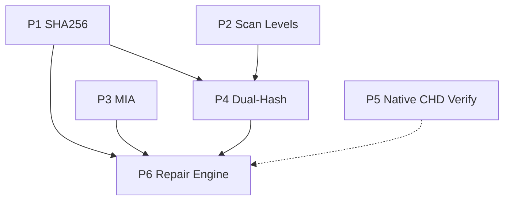

# RVWorld-Inspired Improvements — Implementation Plan

**Date**: 2026-05-21  
**Status**: Planned  
**Source**: RVWorld source analysis (Apache-2.0 — algorithm reuse permitted with attribution)

---

## Summary

Six improvement areas identified from a full source-level review of the RVWorld codebase
(CHDlib, Compress, DATReader, FileScanner, RomVaultCore, TrrntZip, ByteSortedList, RVIO).
Scope spans parser, hash, DB, compendium, verification, CLI, and GUI layers.

---

## Dependency Graph



**Recommended execution sequence**: P1 → P3 → P2 → P4 → P5 → P6

---

## P1 — SHA256 in DAT parsing and DB schema

**Complexity**: M  
**Scope**: Parse `sha256` from Logiqx XML and ClrMamePro DATs; store in compendium `game_signatures`
and runtime `dat_entries`; extend hash matching to include SHA256. No library-side file hashing yet —
storage and matching only.

**Files to create**:
- `tests/fixtures/dat_with_sha256.xml`
- `tests/fixtures/clrmamepro_with_sha256.dat`

**Files to modify**:
- `src/core/dat_parser.h/.cpp` — add `QString sha256` to `DatRomEntry`; parse `sha256` XML attribute
- `src/metadata/clrmamepro_parser.h/.cpp` — add `QString sha256` to `ClrMameProEntry`; parse token
- `src/metadata/compendium_types.h` — extend `NormalizedHashes` with `sha256`
- `src/metadata/compendium_dat_extractor.cpp` — carry SHA256 into payload
- `src/metadata/compendium_fact_inserter.cpp` — insert `hash_type='sha256'` rows
- `src/metadata/compendium_identity_linker.cpp` — include SHA256 in linking lookup order
- `src/core/verification_storage_schema.cpp` / `verification_storage_dat.cpp` — persist SHA256 in runtime DAT import
- `src/core/verification_hash_matcher.h/.cpp` — extend to accept SHA256 as priority hash type
- `src/core/verification_engine_verify.cpp` — match using SHA256 where available
- `tests/test_dat_parser.cpp`, `tests/test_clrmamepro_parser.cpp`, `tests/test_compendium_dat_extractor.cpp`

**Schema changes**:
```sql
ALTER TABLE dat_entries ADD COLUMN sha256 TEXT;
ALTER TABLE patch_dat_entries ADD COLUMN sha256 TEXT;
CREATE INDEX IF NOT EXISTS idx_dat_entries_sha256 ON dat_entries(sha256);
CREATE INDEX IF NOT EXISTS idx_patch_dat_entries_sha256 ON patch_dat_entries(sha256);
-- compendium: existing typed-signature table accepts hash_type='sha256' rows without DDL change
CREATE INDEX IF NOT EXISTS idx_game_signatures_lookup ON game_signatures(hash_type, hash_value);
```

**Risk flags**:
- Hidden tuple-order assumptions in callers; hidden hash-count assumptions in several places
- Uppercase/lowercase normalization must be consistent; silent mismatches if casing diverges
- Partial implementation can leave mismatched semantics between runtime DB and compendium DB

**Acceptance criteria**:
- XML `<rom sha256="...">` and ClrMamePro `sha256 ...` tokens are parsed and preserved
- SHA256 signatures appear in compendium and runtime DAT import storage
- Hash matcher can match DAT entries using SHA256 where no CRC32/SHA1/MD5 is present
- Existing CRC32/MD5/SHA1 behavior unchanged for legacy DATs

---

## P3 — MIA ("Missing In Action") tracking

**Complexity**: M  
**Scope**: Parse `mia="yes"` from XML and ClrMamePro DATs; persist in compendium and runtime DB;
surface as a distinct state in coverage TSV, CLI output, and GUI so known-undumped entries are
not treated as ordinary missing dumps.

**Files to create**:
- `tests/fixtures/dat_with_mia.xml`
- `tests/fixtures/clrmamepro_with_mia.dat`

**Files to modify**:
- `src/core/dat_parser.h/.cpp` — `bool isMia = false` on `DatRomEntry`; parse `mia="yes"` attribute
- `src/metadata/clrmamepro_parser.h/.cpp` — `bool isMia = false`; parse ClrMamePro `mia yes` token
- `src/metadata/compendium_types.h`, `compendium_dat_extractor.cpp`, `compendium_fact_inserter.cpp` — propagate flag
- `src/core/verification_storage_schema.cpp` / `verification_storage_dat.cpp` — `is_mia` column in runtime tables
- `src/core/verification_engine_verify.cpp` — `getMissingGames()` preserves MIA flag; callers can separate
- `src/core/verification_engine_report.cpp` — include MIA in export
- `src/cli/cli_commands_compendium_coverage.cpp` — add `mia_total`, `mia_missing` columns to TSV
- `src/cli/cli_commands_verify.cpp` — print "Known undumped (MIA)" vs ordinary missing
- `src/gui/models/verification_result_model.h/.cpp` — add `isMia` role
- `src/gui/qml/views/VerifyView.qml` — distinct visual treatment for MIA entries

**Schema changes**:
```sql
ALTER TABLE dat_entries ADD COLUMN is_mia INTEGER NOT NULL DEFAULT 0;
ALTER TABLE patch_dat_entries ADD COLUMN is_mia INTEGER NOT NULL DEFAULT 0;
CREATE INDEX IF NOT EXISTS idx_dat_entries_mia ON dat_entries(dat_id, is_mia);
ALTER TABLE source_items ADD COLUMN is_mia INTEGER NOT NULL DEFAULT 0;
```

**Risk flags**:
- ClrMamePro MIA syntax varies by source; needs fixture-backed examples before broad claims
- If MIA is stored only in payload JSON, downstream reporting will be fragile
- MIA should be visually distinct in GUI but must not be counted as success

**Acceptance criteria**:
- DAT import preserves `mia="yes"` entries end-to-end
- Coverage report TSV includes separate `mia_total` and `mia_missing` columns
- CLI verify/coverage output labels MIA entries distinctly from ordinary missing
- GUI verification view distinguishes MIA from missing
- Missing counts can be reported with and without MIA

---

## P2 — Three-level scan mode

**Complexity**: L  
**Scope**: Introduce explicit scan fidelity levels (Timestamp=1, ArchiveHeaderCRC=2, FullHash=3) so
Remus can reuse prior scan state at equal-or-higher confidence and refuse to treat a lower-fidelity
row as good enough when a higher level is requested.

**Files to create**:
- `src/core/scan_policy.h/.cpp` — `enum class ScanLevel`; upgrade-decision matrix helpers
- `tests/test_scan_policy.cpp`

**Files to modify**:
- `src/core/database_types.h` — add `scanLevel`, `scanLastModified`, `archiveCrc32`
- `src/core/database_schema.cpp` / `database_files.cpp` / `database.h` — persist/read scan metadata
- `src/core/scanner.h/.cpp` — `ScanOptions` struct; ZIP central-directory CRC extraction without decompression
- `src/services/hash_service.h/.cpp` — accept `ScanLevel`; implement per-level behaviour; "should trust existing row" predicate
- `src/services/library_service.cpp` — thread scan options through
- CLI scan commands — `--scan-level 1|2|3`
- `tests/test_hash_service.cpp`, `tests/test_scanner.cpp`, `tests/test_archive_extractor.cpp`

**Schema changes**:
```sql
ALTER TABLE files ADD COLUMN scan_level INTEGER NOT NULL DEFAULT 0;
ALTER TABLE files ADD COLUMN scan_last_modified TEXT;
ALTER TABLE files ADD COLUMN archive_crc32 TEXT;
CREATE INDEX IF NOT EXISTS idx_files_scan_level ON files(scan_level, scan_last_modified);
```

**Decision matrix**:
- Level 1: reuse if file `mtime` matches stored value and `scan_level >= 1`
- Level 2: reuse if ZIP central-directory CRC matches and `scan_level >= 2`
- Level 3: reuse if full hashes exist and `scan_level == 3` with matching timestamp or archive metadata
- Refusal rule: a Level-1 DB row is never accepted when Level 2/3 is requested

**Risk flags**:
- `hash_calculated` boolean used in many callers; converting to fidelity enum has wide blast radius
- ZIP central-directory CRC parsing is tool-output-dependent; must be resilient to `unzip` and `7z` variants
- Timestamp-only mode can confuse users unless CLI/GUI exposes trust level clearly

**Acceptance criteria**:
- Remus exposes three scan levels in CLI and internal service APIs
- Unchanged files scanned at equal-or-higher fidelity are skipped correctly
- A Level-1 row is not accepted when Level-2/3 is requested
- ZIP members accepted at Level 2 via central-directory CRC without full decompression
- Existing Level-3 behavior preserved when `--scan-level 3` is used

---

## P4 — Headered-ROM dual-hash

**Complexity**: L  
**Scope**: Detect cartridge headers by magic bytes (NES iNES, SNES SMC, PCE, Lynx, A7800), compute
full-file and header-stripped hashes in a single streaming pass, store both sets, and allow
verification to match DAT entries against either hash set.

**Files to create**:
- `src/core/header_detector.h/.cpp` — magic/offset detection table
- `tests/test_header_detector.cpp`
- `tests/fixtures/headered_roms/` — minimal synthetic files for each supported type

**Files to modify**:
- `src/core/hasher.h/.cpp` — streaming dual-digest; add `AltHashResult`; replace `readAll()` path
- `src/services/hash_service.h/.cpp` — expose and persist dual-hash result
- `src/core/database_types.h` — `altCrc32`, `altMd5`, `altSha1`, `headerSize`, `headerType`
- `src/core/database_schema.cpp` / `database_files.cpp` — alt-hash columns; index
- `src/core/verification_hash_matcher.h/.cpp` — try primary hashes then alt hashes; annotate result
- `src/core/verification_engine.h` / `verification_engine_verify.cpp` — `matchedViaAltHash` flag
- `src/cli/cli_commands_verify.cpp` — note when a match depended on header stripping
- `tests/test_hash_service.cpp`, `tests/test_verification_engine.cpp`

**Schema changes**:
```sql
ALTER TABLE files ADD COLUMN alt_crc32 TEXT;
ALTER TABLE files ADD COLUMN alt_md5 TEXT;
ALTER TABLE files ADD COLUMN alt_sha1 TEXT;
ALTER TABLE files ADD COLUMN header_size INTEGER NOT NULL DEFAULT 0;
ALTER TABLE files ADD COLUMN header_type TEXT;
CREATE INDEX IF NOT EXISTS idx_files_alt_hashes ON files(alt_crc32, alt_md5, alt_sha1);
```

**Key algorithm**:
Stream file once; update two digest contexts. Context B starts consuming at byte `headerSize`.
If no header detected only context A is used — zero overhead for unrecognised file types.

**Header detection rules**:
| Type | Magic / rule | Skip bytes |
|------|-------------|-----------|
| NES iNES | `NES\x1A` at offset 0 | 16 |
| SNES SMC | File size % 1024 == 512 | 512 |
| PCE | `\x40\xFF\xAA\xBB` or format rule | (per spec) |
| Lynx | `LYNX` at offset 0 | 64 |
| A7800 | `ATARI7800` at offset 1 | 128 |

**Dependencies**: P2 scan-level storage is adjacent (both touch `files` table).

**Risk flags**:
- Current `Hasher` uses `readAll()`; adapting to streaming is required for correctness and performance
- Header heuristics can produce false positives on edge-case dumps
- `HeaderMismatch` status semantics need clarification so verified-via-alt does not regress UX

**Acceptance criteria**:
- Supported headered ROM types yield both primary and alt hash sets in one pass
- Files DB stores alt hashes and header metadata
- Verification matches DAT entries using either full-file or header-stripped hashes
- CLI/GUI/reporting indicate when a match depended on header stripping
- Unsupported file types continue to behave exactly as before

---

## P5 — Native CHD verification

**Complexity**: XL  
**Scope**: Replace `chdman verify` process spawning with a native C++ verifier that parses CHD V1–V5,
decompresses all block types (ZLIB, ZSTD, LZMA, Huffman, FLAC), computes `rawsha1` and
metadata-inclusive `sha1`, and runs with bounded parallelism and a weighted block cache.
Conversion remains delegated to `chdman`.

**Files to create**:
- `src/core/chd_reader.h/.cpp` — public verify API and orchestration
- `src/core/chd_map_decoder.h/.cpp` — Huffman+RLE V5 map; delta-offset decoding
- `src/core/chd_codecs.h/.cpp` — zlib/zstd/lzma/FLAC decompression adapters
- `src/core/chd_block_cache.h/.cpp` — weighted LRU/priority cache for `COMPRESSION_SELF` blocks
- `src/core/chd_metadata.h/.cpp` — metadata linked-list parse, tag-sort, SHA1 accumulation
- `tests/test_chd_reader.cpp`
- `tests/fixtures/chd/` — curated minimal CHDs: V1–V5; each codec; metadata-bearing; self-reference blocks

**Files to modify**:
- `src/services/chd_converter.h/.cpp` — route `verifyCHD()` through native reader; `getCHDInfo()` can stay on `chdman`
- `src/cli/cli_commands_chd.cpp` — update messaging
- `CMakeLists.txt` — link zlib (likely present), zstd, lzma, FLAC; feature-gate optional codecs
- `tests/test_chd_converter.cpp` — update to exercise native verify path

**Schema changes**: None.

**Key algorithms**:
- Weighted block cache: LZMA=23×, Huffman=64×, FLAC=2×, ZLIB/ZSTD=1× weight; bounded at 512 MB
- `sha1` = SHA1(rawsha1 ∥ metadata entries sorted by 4-byte tag)
- Parallel pipeline: `QThreadPool` workers per hunk; `QSemaphore` bounds lookahead; results assembled in logical-block order

**Risk flags**:
- Highest technical risk item; CHD map and metadata semantics are subtle and easy to get wrong
- Fixture coverage is the gating factor; acceptance is weak without known-good CHDs from multiple versions
- FLAC track-boundary handling is subtle
- `COMPRESSION_MINI` blocks (8-byte value expanded to fill hunk) are an easy omission

**Acceptance criteria**:
- `verifyCHD()` succeeds without spawning `chdman`
- Native verifier supports CHD V1–V5 files in the fixture set
- Reported `rawsha1` and `sha1` match known-good values
- Verification runs in parallel with deterministic results
- Conversion commands still use `chdman` unchanged

---

## P6 — Find/Fix repair engine

**Complexity**: XL  
**Scope**: Build a deterministic repair pipeline — scan collection into indexed `FileGroup` objects,
resolve missing targets via six hash indexes (CRC32, SHA1, MD5, AltCRC32, AltSHA1, AltMD5),
schedule archive-safe repairs with cascading dependency ordering, and quarantine corrupt archives.
CLI-first; dry-run before mutation.

**Files to create**:
- `src/core/repair_types.h` — `FileGroup`, `RepairCandidate`, `RepairPlan`, `RepairAction`
- `src/core/repair_index.h/.cpp` — six sorted `QVector<IndexEntry>` with binary search
- `src/core/repair_scanner.h/.cpp` — populate `FileGroup`s from DB or fresh collection scan
- `src/core/repair_planner.h/.cpp` — missing-ROM → source resolution; cascading queue; dry-run output
- `src/core/repair_executor.h/.cpp` — atomic write (temp → fsync → rename); corrupt quarantine
- `src/core/repair_archive_writer.h/.cpp` — archive mutation (insert/replace entries)
- `src/core/repair_reporter.h/.cpp` — summary for CLI and GUI
- `src/cli/cli_commands_repair.cpp`
- `tests/test_repair_index.cpp`, `tests/test_repair_planner.cpp`, `tests/test_repair_executor.cpp`
- `tests/fixtures/repair/`

**Files to modify**:
- `src/core/database_schema.cpp` / `database.h` — optional `repair_jobs` + `repair_actions` tables
- `src/core/verification_engine_verify.cpp` — `getMissingGames()` reused as planner input; filter MIA
- `src/services/hash_service.cpp` — expose alt hashes for repair scanner
- `src/cli/cli_options.cpp` / `main.cpp` — route repair commands

**Schema changes** (optional but recommended):
```sql
CREATE TABLE IF NOT EXISTS repair_jobs (
    id INTEGER PRIMARY KEY AUTOINCREMENT,
    created_at TIMESTAMP DEFAULT CURRENT_TIMESTAMP,
    status TEXT NOT NULL,
    dry_run INTEGER NOT NULL DEFAULT 1
);
CREATE TABLE IF NOT EXISTS repair_actions (
    id INTEGER PRIMARY KEY AUTOINCREMENT,
    job_id INTEGER NOT NULL REFERENCES repair_jobs(id) ON DELETE CASCADE,
    action_type TEXT NOT NULL,
    source_file_id INTEGER,
    target_path TEXT NOT NULL,
    matched_hash_type TEXT NOT NULL,
    used_alt_hash INTEGER NOT NULL DEFAULT 0,
    strip_header INTEGER NOT NULL DEFAULT 0,
    status TEXT NOT NULL DEFAULT 'planned',
    error_text TEXT
);
```

**Key algorithms**:
- Six sorted indexes; preference order: CRC32 → SHA1 → MD5 → AltCRC32 → AltSHA1 → AltMD5
- Cascading queue: build dependency graph (archive B needed by archive A); topological sort; cycle detection
- Executor atomicity: write to `__remus_tmp_XXXXXX` in same directory → `fsync` → `rename`
- Unrecoverable archives moved to `Corrupt/`; unmatched leftovers routed to `ToSort/`

**Dependencies**: P4 (alt hashes) and P3 (MIA filtering) must complete first. P2 helpful but not required.

**Risk flags**:
- Largest scope and widest blast radius of all items
- Archive mutation is failure-prone; without staged writes and rollback discipline, corruption risk is high
- Cascading dependency ordering can deadlock if archive relationships are not modelled carefully
- Mixing DB-backed scans with fresh filesystem state can create stale repair plans

**Acceptance criteria**:
- Repair planner ingests a scanned collection and produces deterministic repair actions
- Missing ROMs resolved through any of the six indexes
- Alt-hash matches strip headers before writing target output
- Archive dependencies scheduled in a valid topological order
- Corrupt archives moved to a dedicated directory, not merely logged
- `--dry-run` explains planned actions without mutating the collection

---

## Sprint-sized breakdown

| Ticket | Content | Size |
|--------|---------|------|
| P1 | SHA256 parse + schema + tests | M |
| P3 | MIA parse + schema + reporting | M |
| P2a | `ScanLevel` enum + DB schema + policy tests | M |
| P2b | Archive-header CRC (Level 2) + scanner integration | M |
| P4a | `HeaderDetector` + dual-digest hasher + storage | M |
| P4b | Verification matcher alt-hash + CLI annotation | S |
| P5a | CHD header/map reader + V1–V5 parsing | L |
| P5b | Codec adapters + parallel pipeline + weighted cache | L |
| P6a | `RepairIndex` + `RepairScanner` + `RepairPlanner` (dry-run only) | L |
| P6b | `RepairExecutor` + `RepairArchiveWriter` + corrupt quarantine | L |

---

## Stop conditions

- **Schema migration**: if the compendium DB has no migration mechanism beyond bootstrap SQL, pause before any schema change until the migration path is agreed.
- **P5 scope**: if CHD native verification must support every codec variant from day one with no staged fallback, split into formal milestones; the full scope in one delivery is too risky.
- **P6 repair mutations**: if repair must mutate archives without a dry-run path or transaction log, stop until rollback/atomicity requirements are defined.
- **P2 backward compatibility**: if scan mode must be backward-compatible with existing `files` rows without any rescan or lazy-upgrade behaviour, stop until a compatibility strategy is defined.

---

*RVWorld source references (Apache-2.0): CHDlib (`CHD.cs`, `CHDHeaders.cs`, `CHDBlockRead.cs`, `CHDCodec.cs`), FileScanner (`FileScan.cs`, `FileHeaders.cs`), DATReader (`DatXMLReader.cs`, `DatCmpReader.cs`), FindFix (`FindFixes.cs`, `FileGroup.cs`), ByteSortedList (`ByteSortedList.cs`, `BinarySearch.cs`).*
