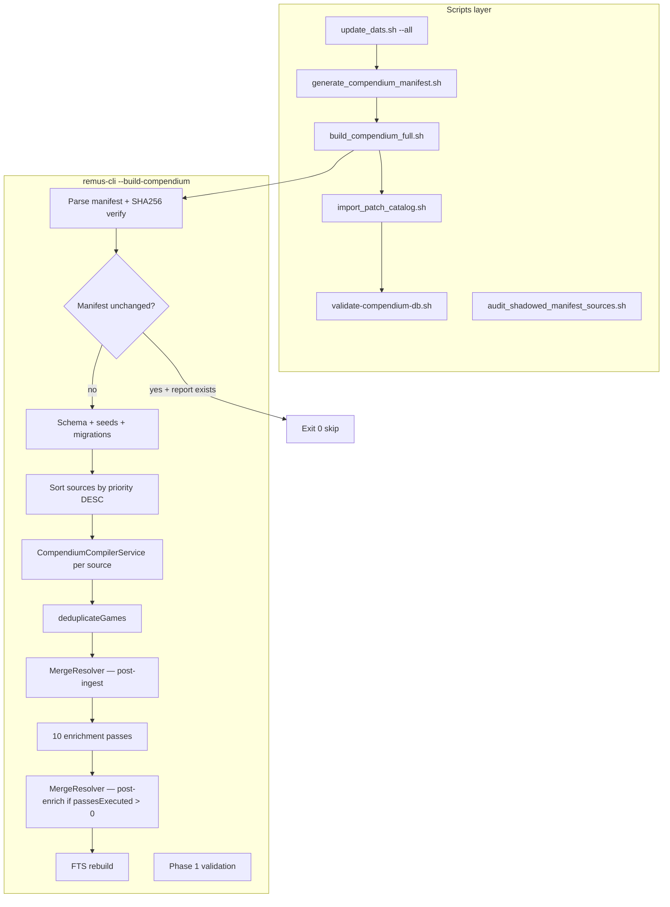
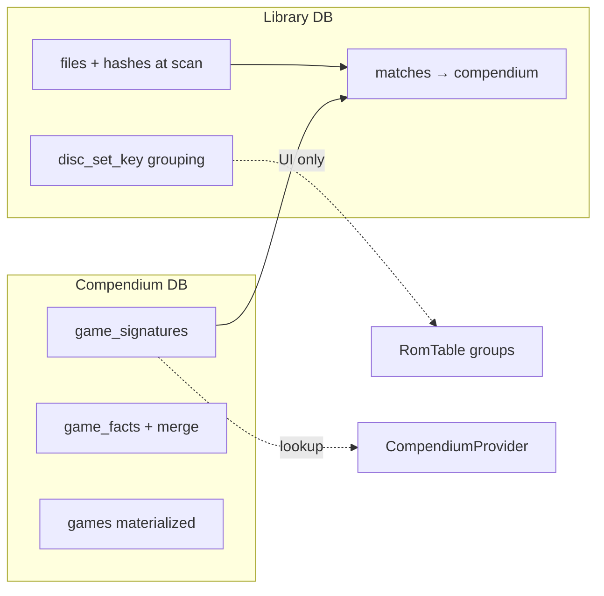

# Compendium Build — Deep Research & Enhancement Roadmap

**Date:** 2026-06-18
**Scope:** Full pipeline review — scripts, ingest, enrichment, merge, validation, ops — plus
industry context and complementary tasks beyond the deferred multi-disc / SHA256 items.

**Companion docs:**

- [COMPENDIUM-MULTI-DISC-SHA256-RESEARCH.md](COMPENDIUM-MULTI-DISC-SHA256-RESEARCH.md) — focused analysis of deferred hash gaps
- [COMPENDIUM-DATA-SOURCES.md](COMPENDIUM-DATA-SOURCES.md) — source inventory
- [compendium-completeness-plan-2026-05-26.md](../plans/compendium-completeness-plan-2026-05-26.md) — G6–G9 bulk enrichers (implemented)

---

## Executive summary

Remus has a **mature, manifest-driven compendium pipeline** (DAT sync → manifest → ingest →
10 enrichment passes → merge → FTS → validation → coverage report). Recent sprints fixed
critical correctness issues (ingest priority, PlayMatch joins, credential gating, bridge pass
order, shadowed libretro-dat auto-disable).

**Remaining work clusters into five themes:**

| Theme | Highest-impact item | Effort |
|-------|---------------------|--------|
| **Hash identity** | Multi-track ingest + SHA256 bridges | Medium |
| **Enrichment efficiency** | IGDB skip when `igdb_id` already resolved | Low |
| **Ops / observability** | Export pass failures; harden phase-2 in CI | Low |
| **Data acquisition** | `catver.ini` in `update_dats.sh`; Hasheous offline dumps | Medium |
| **Cache / rebuild** | Enrichment-input-aware skip invalidation | Medium |

**Industry alignment:** RomM 4.x–4.9 invested heavily in hash-first matching (Hasheous,
PlayMatch), CHD header hashing ([PR #3385](https://github.com/rommapp/romm/pull/3385)),
and multi-hash Hasheous payloads ([PR #3498](https://github.com/rommapp/romm/pull/3498)).
Remus's **bulk offline compendium** model is ahead for reproducible builds but **behind** on
runtime hash extraction (CHD) and Hasheous API modernization.

---

## 1. Pipeline architecture (current)

### 1.1 Enrichment pass order (verified)

From `src/cli/cli_compendium_build_phases.cpp`:

| # | Pass | Enabled when | Hash scope for gaps |
|---|------|--------------|---------------------|
| 1 | Libretro metadata | `data/metadata/` exists | crc32 or serial |
| 2 | GameTDB | `data/gametdb/` | crc32, sha1, md5 |
| 3 | OpenVGDB | sqlite exists | crc32, md5 |
| 4 | **Hasheous** | always (network) | md5, sha1, crc32 — **not sha256** |
| 5 | **PlayMatch** | always (network) | md5, sha1, crc32 — **not sha256** |
| 6 | IGDB bulk | Twitch creds | **any game** with metadata gaps |
| 7 | RA bulk | RA creds | **md5 only** per system |
| 8 | MAME catver | `catver.ini` | arcade, genre gaps |
| 9 | MAME listxml | `listxml.xml` | arcade dev/pub/year |
| 10 | ZXInfo | always (network) | ZX Spectrum |

**Merge triggers:**

- Post-ingest: `compendium_compiler_service.cpp` — full resolve after all DAT sources.
- Post-enrich: only when `passesExecuted > 0` (`cli_compendium_build_phases.cpp`).

**Design strengths:**

- Hasheous/PlayMatch run **before** IGDB (reduces duplicate IGDB catalog downloads when bridges succeed).
- Per-pass gap predicates avoid no-op enrichment on full builds.
- Non-critical passes log and continue on failure.

---

## 2. Confirmed gaps (code-verified)

### 2.1 P0 — Hash identity & matching

#### Multi-track DAT collapse

**File:** `src/metadata/compendium_dat_extractor.cpp` L159–169

One Redump `game` block with Track 01…N → only first non-meta ROM ingested. See
[COMPENDIUM-MULTI-DISC-SHA256-RESEARCH.md](COMPENDIUM-MULTI-DISC-SHA256-RESEARCH.md) §2.3.

**Complementary:** Add validation query counting `source_items` with multi-ROM payloads but
single `game_signatures` row per `game_id`.

#### SHA256 bridge gap

| Component | sha256 | File |
|-----------|--------|------|
| DAT ingest | ✓ | `compendium_dat_extractor.cpp` |
| Identity linker | ✓ | `compendium_identity_linker.cpp` L140–146 |
| CompendiumProvider lookup | ✓ | `compendium_provider.cpp` L150–152 |
| Hasheous runtime | ✗ | `hasheous_provider.cpp` L161–176 |
| Hasheous bulk | ✗ | `compendium_enrichment_hasheous.cpp` L69 |
| PlayMatch bulk | ✗ | `compendium_enrichment_playmatch.cpp` L83, L174 |
| RA bulk | ✗ | MD5-only system query L38–43 |
| `HashAlgorithms` | ✗ | `hash_algorithms.h` — no 64-char case |

**Industry:** Hasheous MCP documents SHA256 lookup; RomM migrated to array payloads (June 2026).
Remus still uses legacy single-object camelCase POST (`mD5`, `shA1`).

#### RA bulk MD5-only system selection

Games with only sha1/crc32/sha256 signatures never enter RA bulk enrichment. RA's API is
hash-based; extending the system query to `hash_type IN ('md5','sha1','crc32')` is low cost.

### 2.2 P0 — Ingest & manifest

#### Unmapped DAT systems → orphan `source_items`

`CompendiumNormalizer::resolveSystemId` → `SystemResolver::systemIdByDatName` returns 0 for
unknown DAT names. `FactInserter` skips `games`/`game_signatures` when `resolvedSystemId <= 0`.

**Effect:** `source_items` inflate; coverage shows `sigs_owned=0`. Mitigated by
`EXCLUDED_SOURCE_IDS` and superseding slug auto-disable in manifest generation, but new DATs
can slip through until manual exclusion.

**Complementary:** Phase-2 check for enabled sources with `source_items > 0` and zero linked games.

#### Silent empty DAT ingest

`compendium_compiler_service.cpp` — enabled source with parse failure or zero entries: warning
- `continue`, build does not fail. Surfaces late in coverage/shadow audit.

**Complementary:** Fail build (or phase-1 gate) when any **enabled** manifest source produces
zero `source_items`.

#### Global `UNIQUE(hash_type, hash_value)`

Schema `0001_phase1_canonical_schema.sql` L107 — first writer wins on hash collision.

**Implications:**

- Ingest priority DESC fix (recent) ensures Redump beats libretro-dat — correct.
- Multi-track ingest (Tier 2) may hit `INSERT OR IGNORE` on shared Redump audio tracks across
  unrelated titles — expected ClrMamePro behavior; not automatically wrong.

**Complementary:** Diagnostic validation listing hash values linked to >1 `game_id` (informational).

### 2.3 P1 — Enrichment efficiency & correctness

#### IGDB bulk ignores existing `igdb_id`

`hasIgdbBulkMetadataGaps()` (`cli_compendium_build_phases.cpp` L90–101) checks **any** game
with metadata gaps — not scoped to games lacking `igdb_id` facts.

After Hasheous/PlayMatch write `igdb_id`, IGDB may still download **entire platform catalogs**
for systems with remaining description/genre gaps on other games.

**Fix:** Extend predicate: skip IGDB platform download when all hash-linked gap games already
have `igdb_id` in `game_facts` or `games.igdb_id`.

**Industry:** RomM uses provider priority lists and "Unmatched" scan modes to avoid re-fetching;
Remus bulk IGDB has no per-platform short-circuit.

#### Hasheous vs PlayMatch `igdb_id` predicate asymmetry

| Pass | Skip when |
|------|-----------|
| Hasheous | `igdb_id` fact from source `hasheous` only |
| PlayMatch | `igdb_id` fact from **any** source |

Intentional (PlayMatch is secondary bridge) but can cause Hasheous to re-hit games PlayMatch
already resolved via another source's `igdb_id` fact if Hasheous wrote nothing.

**Complementary:** Align Hasheous skip with PlayMatch (any `igdb_id`) OR document why not.

#### `passesFailedWithError` not in build report

`EnrichmentStats::passesFailedWithError` incremented L476 but **not** exported in
`insertEnrichmentStatsReportFields()` L220–257.

**Effect:** ZXInfo/Hasheous failures invisible in JSON report; full build exits 0.

#### Manifest rebuild skip ignores enrichment inputs

`cli_commands_compendium.cpp` L172–196 — skip when `compendium_builds.source_manifest_json`
matches. Changes to GameTDB XML, OpenVGDB sqlite, listxml, libretro metadata, or credentials
do **not** invalidate cache.

**Complementary:** Extend skip key with content hashes of enrichment input directories/files.

#### Deferred merge policies in seed data

`compendium_merge_resolver.cpp` — `normalized_name_similarity` and `newer_snapshot` seeded but
not implemented. Title conflicts use length/priority heuristics only.

### 2.4 P1 — Data acquisition gaps

#### `catver.ini` fetch

`scripts/update_dats.sh` downloads catver.ini from progetto-SNAPS when network is available.
MAME catver enrichment expects `data/mame/catver.ini`.

#### Hasheous offline dumps

`scripts/update_hasheous_dumps.sh` downloads platform ZIPs; `compendium_enrichment_hasheous.cpp`
uses the offline index when `--online-enrichment` is set without `--online-enrichment-all`.

#### Wii U digital No-Intro

Documented in COMPENDIUM-DATA-SOURCES; not in `update_dats.sh` `CORE_SYSTEMS`. Relies on
`--all` copying full `metadat/no-intro/` — works but not explicit like Wii U Redump fallback.

### 2.5 P1 — Ops & validation

#### Phase 2 warn-only in full build

`build_compendium_full.sh` L268–272 — phase-2 failures print warning, exit 0.

Checks that often fail in practice:

| Check | Threshold | Common cause |
|-------|-----------|--------------|
| `enrichment.genre_coverage_pct` | ≥55% | Large MAME set, systems without genre sources |
| `enrichment.arcade_missing_developer` | 0 | Missing listxml |
| `coverage.shadowed_sources` | ≤40 | libretro-dat bloat (partially mitigated) |
| `catalog.patch_sources_nonempty` | >0 | Patch import skipped |

**Complementary:** CI job with phase-1 hard fail + phase-2 trend dashboard (not blocking).

#### Patch import warn-only

`build_compendium_full.sh` L260–261 — patch catalog failure does not fail build.

#### `test_enricher.sh` stale source list

Omits `hasheous` and `playmatch` (present in `cli_options.cpp` L198).

---

## 3. Industry research (RomM & ecosystem)

### 3.1 RomM metadata stack evolution

| Version | Relevant change |
|---------|-----------------|
| 4.0 | Hasheous + PlayMatch hash matching; hash calculated before metadata fetch |
| 4.9 | CHD raw + disc-data SHA1 routing to Hasheous ([PR #3385](https://github.com/rommapp/romm/pull/3385)) |
| 4.9+ | PlayMatch as explicit metadata source; multi-hash Hasheous array ([PR #3498](https://github.com/rommapp/romm/pull/3498)) |

**RomM scan modes** (relevant to Remus incremental enrich):

- **Unmatched** — re-match ROMs missing external IDs (after adding provider).
- **Update** — re-fetch metadata for matched ROMs.
- **Hashes** — recalculate hashes only.

**Remus analogue:** `--enrich-compendium` with `--enrich-source` filter — good for incremental
API passes; no equivalent for "re-ingest one DAT" without full manifest rebuild.

### 3.2 Hasheous capabilities vs Remus usage

| Hasheous feature | Remus bulk | Remus runtime |
|------------------|------------|---------------|
| CRC/MD5/SHA1 POST | ✓ | ✓ |
| SHA256 | ✗ | ✗ |
| Array multi-hash payload | ✗ | ✗ |
| Offline platform ZIP dumps | ✗ (planned) | N/A |
| MetadataProxy (IGDB) | optional key | optional key |
| TOSEC/MAME/Redump/No-Intro index | via API | via API |

### 3.3 CHD/RVZ — ecosystem consensus

From [RomM #2241](https://github.com/rommapp/romm/issues/2241) and community analysis:

- DATs index **uncompressed** Redump hashes; container hashes differ.
- CHD header "Data SHA1" works for single-track DVD; multi-track CD is unreliable.
- Metadata agents plan CHD-specific DATs rather than on-the-fly decompression.
- **Remus action:** library scan CHD extraction (Tier 4); not compendium DAT ingest.

### 3.4 LaunchBox / offline-first pattern

RomM 4.0+ downloads LaunchBox DB **locally** for filename matching. Remus already mirrors this
pattern with GameTDB XML, OpenVGDB sqlite, libretro metadata — **bulk offline enrichers**.
Hasheous offline dumps would complete the same pattern for hash→metadata bridges.

---

## 4. Efficiency improvements (prioritized)

### High impact

| # | Improvement | Files | Notes |
|---|-------------|-------|-------|
| E1 | IGDB platform-scoped gap + `igdb_id` awareness | `cli_compendium_build_phases.cpp`, `compendium_enrichment_igdb.cpp` | Cuts largest API cost |
| E2 | Enrichment-input hash in rebuild skip | `cli_commands_compendium.cpp` | Avoid stale DB when only GameTDB changed |
| E3 | Hasheous offline dump enricher | new script + `compendium_enrichment_hasheous.cpp` | No per-game HTTP; obscure systems |
| E4 | Content-hash DAT sync | `update_dats.sh` | `gametdb_payload_matches` pattern for DATs |
| E5 | SHA256 + multi-track ingest | see multi-disc research doc | Direct match coverage |

### Medium impact

| # | Improvement | Notes |
|---|-------------|-------|
| E6 | Parallel manifest SHA256 | `generate_compendium_manifest.sh` — 300+ sequential hashes |
| E7 | listxml cache by MAME version | `update_dats.sh` — skip ~400MB regen |
| E8 | Incremental FTS | Skip full delete/rebuild when only enrichment changed |
| E9 | Export `passesFailedWithError` + fail if creds configured | Observability |
| E10 | Hasheous array API migration | Align with RomM #3498 |

### Low impact / hygiene

| # | Improvement |
|---|-------------|
| E11 | Sync `test_enricher.sh` with `cli_options.cpp` |
| E12 | Update `data/compendium/README.md` migration list (0005/0006) |
| E13 | Manifest DAT existence preflight before write |
| E14 | Remove duplicate `DAT_DIR` assignment in manifest script |

---

## 5. Validation gaps & proposed checks

### Existing

| File | Role |
|------|------|
| `0000_bootstrap_checks.sql` | Empty DB schema + seeds |
| `0001_phase1_checks.sql` | Hard gates: content nonzero, orphans, collisions |
| `0002_phase2_quality_checks.sql` | Soft thresholds (genre %, shadowed sources, etc.) |

### Recommended additions (`0003_phase2_extended_checks.sql` or inline)

| Check | Purpose |
|-------|---------|
| `identity.sha256_signature_count` | Baseline sha256 coverage per modern system |
| `enrichment.igdb_id_coverage_pct` | Materialized + fact `igdb_id` rate |
| `enrichment.ra_achievement_count_populated` | Post-0006 migration effectiveness |
| `enrichment.unmapped_source_items` | `source_items` with no linked `games` |
| `identity.multi_track_signature_proxy` | Multi-ROM payloads vs signature count |
| `merge.unresolved_conflicts` | Gate when >0 (build already exits 2) |
| `fts.coverage_vs_games` | FTS rows vs game count |
| `enrichment.snapshot_presence` | `hasheous-bulk`, `playmatch-bulk`, etc. in `source_snapshots` |
| `ingest.enabled_source_zero_items` | Enabled manifest source with 0 items |

---

## 6. Complementary tasks by workstream

### 6.1 Testing

| Task | Value |
|------|-------|
| Multi-track DAT fixture + extractor test | Prevents Tier 2 regression |
| SHA256 bridge eligibility unit test | Predicate + hash load SQL |
| Minimal manifest integration test (`--skip-update`) | End-to-end smoke without network |
| Shared Redump track collision fixture | Documents expected `INSERT OR IGNORE` behavior |
| Enrichment report JSON schema test | `passesFailedWithError` export |

### 6.2 Ops / CI

| Task | Value |
|------|-------|
| `update_dats.sh` fetch `catver.ini` | Unblocks MAME genre pass |
| Phase-1 hard fail in CI; phase-2 report artifact | Quality trend without blocking releases |
| Auto-apply shadowed suggestions (human-reviewed PR template) | Reduces manifest toil |
| Build report includes enrichment skip reasons per pass | Debug "why no IGDB" |
| Document `--enrich-compendium` incremental workflow | Parity with RomM "Unmatched" scan |

### 6.3 Schema (future)

| Task | When |
|------|------|
| `game_discs` table | Provider APIs need per-disc metadata | **Plan:** [COMPENDIUM-DISC-SETS-PLAN.md](COMPENDIUM-DISC-SETS-PLAN.md) |
| `source_items.resolved_system_id` diagnostic column | Unmapped ingest visibility |
| Enrichment input versions in `compendium_builds` | Cache invalidation |

### 6.4 Docs

| Task | Status |
|------|--------|
| Multi-disc / SHA256 research doc | Done |
| This deep research doc | Done |
| COMPENDIUM-DATA-SOURCES deferred cross-link | Done |
| Manifest skip invalidation rules | **Todo** |
| Hasheous offline dump runbook | Done — see `data/compendium/README.md` |

---

## 7. Unified priority roadmap

### P0 — Trust matching & data integrity

1. **Multi-track hash ingest** — `compendium_dat_extractor.cpp` Tier 2
2. **SHA256 in bridges** — Hasheous/PlayMatch/RA bulk + Hasheous runtime Tier 1
3. **Fail or prominently gate** enabled sources with zero `source_items`
4. **RA bulk:** extend beyond MD5-only system query

### P1 — Quality & cost (high ROI)

1. **IGDB gap predicate** — respect existing `igdb_id` from bridges
2. **`catver.ini` in `update_dats.sh`**
3. **Export `passesFailedWithError`** in build report; optional fail when >0
4. **Enrichment-input-aware rebuild skip**
5. **Phase-2 extended validation** (unmapped items, sha256 baseline, igdb_id %)
6. **Hasheous offline dump enricher** (from completeness plan)

### P2 — Efficiency & ops

1. Content-hash DAT sync in `update_dats.sh`
2. Hasheous array API migration
3. Shadowed-source audit → manifest PR workflow
4. Align Hasheous `igdb_id` skip with PlayMatch (any source)
5. Implement or remove deferred merge policies in seeds

### P3 — Expansion

1. `game_discs` compendium model
2. Homebrew / TOSEC manifest sources
3. CHD header hashing at library scan (links to compendium via bridges)
4. ScreenScraper / TheGamesDB bulk passes
5. Parallel DAT ingest / incremental FTS

---

## 8. Relationship to library pipeline

Remus now has **two hash identity layers**:

**Complementary cross-layer tasks:**

| Task | Layer | Benefit |
|------|-------|---------|
| CHD header hash at scan | Library | Runtime bridge lookup without decompress |
| Compendium multi-track ingest | Compendium | Hash match when library has track-level hash |
| `igdb_id` in CompendiumProvider | Compendium | Avoid re-hitting IGDB at match confirm |
| Match confirm writes `igdb_id` to library | Library | Persist bridge results locally |

---

## 9. Open questions (updated)

1. **Hasheous array API backward compatibility** — support both payload formats during transition?
2. **IGDB bulk granularity** — per-platform skip vs per-game skip when `igdb_id` exists but metadata empty?
3. **Offline Hasheous dumps** — replace live API entirely on full builds, or hybrid (offline first, API gap-fill)?
4. **Phase-2 hard fail policy** — which checks should block release vs trend-only?
5. **Shared track collisions** — validation warn vs silent `INSERT OR IGNORE`?
6. **MAME + libretro-dat both enabled** — should manifest disable libretro arcade when MAME present?

---

## 10. Key file index

| Area | Path |
|------|------|
| Full pipeline | `scripts/build_compendium_full.sh` |
| Manifest | `scripts/generate_compendium_manifest.sh` |
| DAT sync | `scripts/update_dats.sh` |
| Enrichment | `src/cli/cli_compendium_build_phases.cpp` |
| Build command | `src/cli/cli_commands_compendium.cpp` |
| DAT extract | `src/metadata/compendium_dat_extractor.cpp` |
| Compiler | `src/metadata/compendium_compiler_service.cpp` |
| Merge | `src/metadata/compendium_merge_resolver.cpp` |
| Validation | `data/compendium/validation/0001_phase1_checks.sql`, `0002_phase2_quality_checks.sql` |
| Multi-disc / SHA256 | `docs/reports/COMPENDIUM-MULTI-DISC-SHA256-RESEARCH.md` |

---

*Deep research synthesis: codebase audit + RomM/Hasheous ecosystem review, 2026-06-18.*
