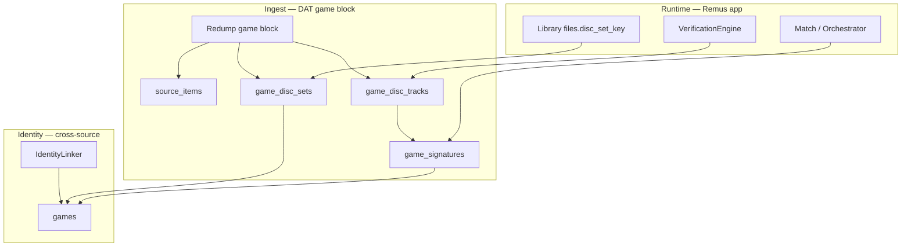

# Compendium Disc Sets — Audited Plan & Best Approach

**Date:** 2026-06-18
**Status:** Implemented (migration 0007, inserter, backfill, M3U export, validation 0004/0005)
**Scope:** Forward-looking design for compendium-native multi-disc topology so Remus can
match, verify, enrich, and organize **without re-parsing DAT titles at runtime**.

**Companion docs:**

- [COMPENDIUM-MULTI-DISC-SHA256-RESEARCH.md](COMPENDIUM-MULTI-DISC-SHA256-RESEARCH.md) — hash/track gaps
- [COMPRESSED-DISC-HASH-ECOSYSTEM-RESEARCH.md](COMPRESSED-DISC-HASH-ECOSYSTEM-RESEARCH.md) — CHD/RVZ content hashes
- [COMPENDIUM-BUILD-DEEP-RESEARCH.md](COMPENDIUM-BUILD-DEEP-RESEARCH.md) — full build pipeline
- [ROM-MATCHING-AUDIT.md](ROM-MATCHING-AUDIT.md) — runtime match cascade

---

## Executive summary — best approach

**Recommendation:** Implement a **`game_disc_sets` + `game_disc_tracks` model** (not a monolithic
`game_discs` table alone), populated at **DAT game-block ingest time**, keyed by a **shared
`set_key`** algorithm used by both compendium and library (`files.disc_set_key`).

| Principle | Decision |
|-----------|----------|
| **Identity** | Keep `game_id` + `game_signatures` as the hash lookup layer (unchanged) |
| **Topology** | New tables describe *which disc/track belongs to which set* |
| **DAT truth** | One compendium disc unit per Redump/No-Intro `game` block — never merge DAT blocks at ingest |
| **Metadata** | Game-level enrichment (IGDB, Hasheous) stays on `games`; discs inherit via `game_id` |
| **Library link** | Match hash → `game_id` → `set_key` → compare with `files.disc_set_key` |
| **Efficiency** | Parse disc titles once at ingest; index `set_key`; no runtime title regex in hot paths |

This is **more complete than `disc_number` on `source_items` alone** (which conflates track-level
rows with disc-level rows) and **less risky than collapsing the schema** around a single
`game_discs` table without track linkage.

---

## 1. Audit of the prior “Recommended path”

The earlier three-phase proposal (disc columns → `game_disc_units` → library bridge) was
directionally correct but needs these corrections:

### 1.1 What still holds

| Item | Verdict |
|------|---------|
| Defer full nested redesign until provider APIs need per-disc metadata | ✅ Correct — IGDB is game-level |
| Shared disc parser between library and compendium | ✅ Required |
| Do not merge separate DAT game blocks into one envelope | ✅ Matches Redump/Igir practice |
| Title merge for one `game_id` across discs | ✅ Keep for enrichment |
| Library `disc_set_key` as the user-facing grouping key | ✅ Align compendium `set_key` to this |

### 1.2 Gaps in the prior plan

| Gap | Impact | Fix in this plan |
|-----|--------|------------------|
| **`source_items` is track-granular** | Adding `disc_number` only on `source_items` duplicates or mis-assigns multi-track discs | Disc units at **game-block** level; tracks in child table |
| **`set_key` algorithm mismatch** | Library uses `baseTitle\|systemName`; compendium uses `system_id` + region | Canonical **`DiscSetKey`** helper: `system_id \| normalized_base \| region_group` |
| **No track↔signature bridge** | Verification matches one hash, not “all tracks present” | `game_disc_tracks.signature_id` FK |
| **Variant pressings** (Shenmue Disc 3 `[1S]`/`[2S]`) | Naive title merge collapses variants | `set_variant` + merge policy enum |
| **Split-path “discs”** (RE2 Leon/Claire) | Should not share one set | `set_role` / separate `set_key` when subtitle differs |
| **CHD/RVZ content SHA1** | Disc units need content-hash primary for compressed matching | `primary_content_sha1` on disc set row (from MAME Redump CHD DAT + scan backfill) |
| **VerificationEngine** | No set completeness today | Phase 5: `verifyDiscSetCompleteness(game_id, set_key, owned_discs)` |
| **Identity linker over-merge risk** | Pass 3 title merge at 60% confidence | Disc ingest must **not** rely on merge for topology — only for `game_id` |

### 1.3 What we explicitly reject

- **Igir-style `--merge-discs` at ingest** — merging DAT entries in the compendium loses per-disc
  hashes and breaks incomplete-set handling.
- **Single `game_discs` row per signature** — conflates disc index with track hashes.
- **Re-parsing `title_raw` in match/verify hot paths** — belongs in ingest + indexed columns.

---

## 2. What the compendium must contain for Remus

Remus subsystems and the compendium data they require:

| Subsystem | Needs from compendium | Today | After disc plan |
|-----------|----------------------|-------|-----------------|
| **Hash match** | `game_signatures` (crc/md5/sha1/sha256/content) | ✅ | ✅ unchanged |
| **Serial match** | `game_serials` | ✅ | ✅ |
| **Multi-signal match** | hashes + `source_items.payload_json` (size, serial) | ✅ | ✅ + disc context in match result |
| **Metadata enrichment** | `games`, `game_facts`, `igdb_id`, `ra_game_id` | ✅ | ✅ game-level only |
| **Patch/hack verify** | `patch_entries` | ✅ | ✅ |
| **Official verify** | hash → expected ROM name/size | ✅ | ✅ per track |
| **Disc set completeness** | expected discs 1..N for a set | ❌ | ✅ `game_disc_sets` |
| **Multi-track verify** | all data tracks for one disc | ⚠️ partial (multi-track ingest) | ✅ `game_disc_tracks` |
| **Library disc grouping** | map `files.disc_set_key` ↔ catalog | ❌ | ✅ shared `set_key` |
| **M3U / bundle** | ordered disc list + paths | ⚠️ library-only | ✅ catalog expected order |
| **CHD/RVZ bridge** | content SHA1 in signatures | ✅ (recent) | ✅ linked on disc set |
| **Provenance / audit** | `source_items`, snapshots | ✅ | ✅ + disc unit FK |
| **Search (FTS)** | `games_fts` | ✅ | optional: index set base titles |
| **Negative cache / miss** | hash uniqueness | ✅ | ✅ |

**Design rule:** The compendium is the **offline source of truth** for everything Remus can do
without network providers. Runtime providers (Hasheous, IGDB) **fill gaps** in `game_facts`;
they do not replace catalog topology.

---

## 3. Target architecture

### 3.1 Layer model



### 3.2 Schema (migration `0007_disc_sets.sql`)

```sql
-- One row per DAT game block (one "disc" in Redump terms).
CREATE TABLE game_disc_sets (
    disc_set_id       INTEGER PRIMARY KEY AUTOINCREMENT,
    game_id           TEXT NOT NULL REFERENCES games(game_id) ON DELETE CASCADE,
    set_key           TEXT NOT NULL,          -- canonical: system_id|base|region
    disc_number       INTEGER NOT NULL DEFAULT 0,
    disc_count        INTEGER NOT NULL DEFAULT 0,
    set_variant       TEXT NOT NULL DEFAULT '', -- pressing / ring code / edition suffix
    set_role          TEXT NOT NULL DEFAULT 'game', -- game | audio | bonus | data
    title_disc        TEXT NOT NULL,          -- raw DAT game name
    source_id         TEXT NOT NULL REFERENCES sources(source_id),
    snapshot_id       TEXT NOT NULL DEFAULT '',
    source_item_id    INTEGER REFERENCES source_items(source_item_id),
    primary_content_sha1 TEXT,                -- CHD/RVZ header/content when known
    UNIQUE (set_key, disc_number, set_variant, source_id, snapshot_id)
);

-- One row per verifiable ROM/track within that disc block.
CREATE TABLE game_disc_tracks (
    track_id          INTEGER PRIMARY KEY AUTOINCREMENT,
    disc_set_id       INTEGER NOT NULL REFERENCES game_disc_sets(disc_set_id) ON DELETE CASCADE,
    track_index       INTEGER NOT NULL DEFAULT 1,
    rom_name          TEXT NOT NULL,
    signature_id      INTEGER REFERENCES game_signatures(signature_id),
    source_entry_key  TEXT NOT NULL,
    UNIQUE (disc_set_id, track_index),
    UNIQUE (source_entry_key)
);

CREATE INDEX idx_game_disc_sets_game ON game_disc_sets(game_id);
CREATE INDEX idx_game_disc_sets_set_key ON game_disc_sets(set_key, disc_number);
CREATE INDEX idx_game_disc_tracks_disc ON game_disc_tracks(disc_set_id);
```

**Why two tables:** Redump separates **disc** (game block) from **track** (ROM line). Remus
already emits one signature per data track (`compendium_dat_extractor.cpp`). The bridge makes
set completeness and track completeness queryable.

### 3.3 Shared `DiscSetKey` (new `src/core/disc_set_key.h`)

Replace ad-hoc string building with one function used by:

- `DiscSetUtils::groupKey()` (library scan)
- Compendium ingest (`game_disc_sets.set_key`)
- Post-match reconciliation (`database_disc_sets.cpp`)

```
set_key = sha1( system_id + "|" + normalizeBaseTitle(title) + "|" + region_group )
```

Use **stable `system_id`**, not display name, so keys survive UI renames. Keep human-readable
`base_title` on library `files.base_title` for display.

### 3.4 Merge policies (identity linker)

Add ingest-time flags on `game_disc_sets` (or a sidecar policy table) — do **not** infer solely
from title merge:

| Policy | Example | `set_key` behavior |
|--------|---------|-------------------|
| `merge_discs` | FF7 Disc 1–3 | Same `set_key`, disc_number 1..3 |
| `split_variant` | Shenmue Disc 3 [1S] vs [2S] | Same disc_number, different `set_variant` |
| `split_path` | RE2 Leon vs Claire | Different `set_key` or `set_role` |
| `standalone` | Single-disc game | disc_number 0 or 1, disc_count 1 |

---

## 4. Implementation plan — logical order

Each phase has **exit criteria** before the next begins.

### Phase 0 — Specification & shared parser (1–2 days)

| Step | Task | Output |
|------|------|--------|
| 0.1 | Extract `DiscTitleParser` from `DiscSetUtils` + `IdentityLinker::normalizeTitle` | `src/core/disc_title_parser.{h,cpp}` |
| 0.2 | Document regex coverage: Redump, TOSEC, MAME, CHD filenames | Unit tests in `test_disc_title_parser.cpp` |
| 0.3 | Define `DiscSetKey::compute(system_id, title, region)` | Stable keys in tests |
| 0.4 | Align library `DiscSetUtils::groupKey` to call `DiscSetKey` (compat layer) | No user-visible regression |

**Exit:** Parser tests cover FF7, MGS Twin Snakes, Shenmue variants, RE2 split, single-disc.

---

### Phase 1 — Schema & migration (1 day)

| Step | Task | Output |
|------|------|--------|
| 1.1 | Add `data/compendium/migrations/0007_disc_sets.sql` | Tables + indexes |
| 1.2 | Wire migration runner (`database_migrations` compendium path) | Idempotent upgrade |
| 1.3 | Add validation stubs in `data/compendium/validation/0004_disc_set_checks.sql` | CI-ready checks |
| 1.4 | Bump compendium schema version in build report | Traceability |

**Exit:** Empty tables created; validation SQL runs on fresh and upgraded DBs.

---

### Phase 2 — Ingest pipeline (3–4 days)

| Step | Task | Output |
|------|------|--------|
| 2.1 | Group `ClrMameProEntry` by `gameName` before envelope emission | `DatGameBlock` struct |
| 2.2 | Emit one `game_disc_sets` row per game block in `FactInserter` | `DiscSetInserter` helper |
| 2.3 | Emit `game_disc_tracks` + existing `game_signatures` per data track | FK linkage |
| 2.4 | Populate `disc_number`, `disc_count`, `set_variant` from `DiscTitleParser` | Parsed columns |
| 2.5 | Set `primary_content_sha1` when source is MAME Redump CHD or hash_type is content | Bridge to P2 CHD work |
| 2.6 | Stats: `disc_sets_created`, `tracks_created` in `CompilerStats` | Build report lines |

**Exit:** Rebuild compendium; FF7 (PS1) shows 3 `game_disc_sets` rows sharing one `game_id` and
one `set_key`; each disc has ≥1 track row.

---

### Phase 3 — Identity linker policy (2 days)

| Step | Task | Output |
|------|------|--------|
| 3.1 | Title merge unchanged for `game_id` assignment | Enrichment unchanged |
| 3.2 | **Do not** use title merge to infer `set_key` — only parser | Prevents over-merge |
| 3.3 | Variant detection: hash suffix / bracket codes → `set_variant` | Shenmue fixture test |
| 3.4 | Split-path detection: subtitle after disc tag → separate set | RE2 / Eve fixtures |
| 3.5 | Dedup: `deduplicateGames` must remap `game_disc_sets.game_id` | FK integrity |

**Exit:** Identity dedup does not orphan disc sets; variant discs remain distinct.

---

### Phase 4 — CompendiumProvider API (2–3 days)

| Step | Task | Output |
|------|------|--------|
| 4.1 | `QList<CompendiumDiscSet> getDiscSetsForGame(game_id)` | Read API |
| 4.2 | `QList<CompendiumDiscSet> getDiscSetsBySetKey(set_key)` | Library bridge |
| 4.3 | Extend `getByHash` / `metadataFromMatch` with optional disc context | `matchedDiscNumber`, `setKey` on metadata |
| 4.4 | `matchROM` corroboration: boost confidence when `input` disc # matches catalog | Multi-signal polish |

**Exit:** CLI/GUI can query expected discs for a matched game without SQL.

---

### Phase 5 — Verification & library bridge (3–4 days)

| Step | Task | Output |
|------|------|--------|
| 5.1 | `VerificationEngine::discSetCompleteness(game_id, owned_file_ids)` | Missing disc report |
| 5.2 | After match confirm: set `files.disc_set_key` from compendium `set_key` | `database_disc_sets.cpp` |
| 5.3 | Reconcile `files.disc_number` vs catalog `disc_number` | Warning in verify report |
| 5.4 | Track-level verify: all tracks for disc present (multi-bin) | PS1/Saturn cases |
| 5.5 | CLI: `--verify-set` or extend `--verify-report` | User-visible completeness |

**Exit:** User with FF7 Disc 2 only gets “missing Disc 1, 3” from compendium-backed verify.

---

### Phase 6 — Validation, CI, backfill (2 days)

| Step | Task | Output |
|------|------|--------|
| 6.1 | Validation: no orphan `game_disc_tracks` | SQL check |
| 6.2 | Validation: `disc_count` ≥ max(`disc_number`) per `set_key` | Consistency |
| 6.3 | Validation: gap detection (1..N contiguous optional warn) | Quality report |
| 6.4 | One-time backfill script for existing `remus_compendium.db` | `scripts/backfill_disc_sets.sh` |
| 6.5 | Phase-2 validation in CI (warn → fail threshold) | Regression gate |

**Exit:** `validate-compendium-db.sh` includes disc set checks; CI green.

---

### Phase 7 — Product surfacing (2–3 days, parallelizable)

| Step | Task | Output |
|------|------|--------|
| 7.1 | Workflow UI: disc set row shows “2/4 discs” badge | GUI |
| 7.2 | M3U generator: prefer catalog disc order when known | `m3u_generator.cpp` |
| 7.3 | Bundle/organize: folder per `set_key` base title | Organize engine |
| 7.4 | Coverage report: % games with disc sets on disc-based systems | `--coverage` |

**Exit:** Multi-disc UX reflects catalog completeness, not filename guesses alone.

---

### Phase 8 — Forward extensions (defer until Phase 5 shipped)

| Step | Task | When |
|------|------|------|
| 8.1 | Ingest TOSEC ring-code variants into `set_variant` | TOSEC manifest sources |
| 8.2 | `game_disc_sets.media_format` enum (cue/chd/rvz/iso) | Post CHD catalog maturity |
| 8.3 | Compendium FTS on set base titles | Search UX |
| 8.4 | Hasheous offline dump → pre-built disc topology | Ops / self-host |
| 8.5 | Per-disc facts table (only if IGDB/add-ons expose disc data) | Provider-driven |

---

## 5. Ingest algorithm (reference)

```
for each DAT file:
  entries = parse(file)
  for each gameName group G:
    disc = parseDiscTitle(G.gameName)
    set_row = game_disc_sets(
      set_key = DiscSetKey(system, disc.base, region),
      disc_number = disc.number,
      disc_count = disc.count,
      set_variant = disc.variant,
      title_disc = G.gameName
    )
    tracks = dataTracksForGame(G)   # existing helper
    for each track t in tracks:
      sig = insert game_signatures(t.hash...)
      insert game_disc_tracks(disc_set_id, t.index, t.romName, sig.id)
    link game_disc_sets.game_id = IdentityLinker(G)
```

**Invariants:**

1. Never insert two DAT game blocks into one `game_disc_sets` row.
2. Every `game_disc_tracks.signature_id` must reference a row in `game_signatures`.
3. `set_key` is computed identically for library scan and compendium ingest.

---

## 6. Testing strategy

| Layer | Tests |
|-------|-------|
| Parser | Redump, TOSEC, variant, split-path fixtures |
| Ingest | `test_compendium_dat_extractor.cpp` — multi-disc + multi-track |
| Inserter | `test_compendium_disc_set_inserter.cpp` (new) |
| Identity | Dedup remaps disc sets |
| Provider | `getDiscSetsForGame` after known hash match |
| Verify | Completeness with partial library |
| Library | `disc_set_key` matches compendium after match confirm |
| E2E | Rebuild mini compendium from fixture DATs → match FF7 set |

---

## 7. Effort & sequencing summary

| Phase | Effort | Depends on |
|-------|--------|------------|
| 0 Parser | 1–2 d | — |
| 1 Schema | 1 d | 0 |
| 2 Ingest | 3–4 d | 0, 1 |
| 3 Linker policy | 2 d | 2 |
| 4 Provider API | 2–3 d | 2 |
| 5 Verify + library | 3–4 d | 0, 4 |
| 6 Validation/CI | 2 d | 2–5 |
| 7 Product UI | 2–3 d | 5 |
| **Total MVP** | **~16–21 d** | Phases 0–6 |

Phases 4 and 5 can overlap after Phase 2 completes.

---

## 8. Success criteria (MVP)

1. **Match:** Any disc hash still resolves to correct `game_id` (no regression).
2. **Topology:** PS1 multi-disc titles have queryable `game_disc_sets` with correct 1..N indices.
3. **Tracks:** Multi-track PS1 bins have all tracks linked under one disc set.
4. **Library:** After match, `files.disc_set_key` equals compendium `set_key`.
5. **Verify:** Engine reports missing discs for incomplete sets.
6. **Variants:** Alternate pressings do not collapse into one disc row.
7. **CHD:** Content SHA1 on disc set when MAME Redump CHD DAT present.
8. **CI:** Validation SQL passes on production compendium build.

---

## 9. Relationship to other roadmaps

| Other work | Interaction |
|------------|-------------|
| CHD/RVZ hashes (shipped) | `primary_content_sha1` + signature bridge on disc sets |
| Multi-track ingest (shipped) | Feeds `game_disc_tracks` directly |
| SHA256 bridges (shipped) | Unchanged; signatures remain lookup keys |
| Hasheous array payload (shipped) | Runtime; compendium stores offline topology |
| `game_discs` (old name) | Renamed/split to `game_disc_sets` + `game_disc_tracks` |
| Igir `--merge-discs` | **Not** replicated at ingest — library/runtime grouping only |

---

## 10. Open decisions (resolve in Phase 0)

| # | Question | Proposed default |
|---|----------|------------------|
| 1 | `disc_count` when unknown? | `0` = unknown; infer max seen per `set_key` in same snapshot |
| 2 | Single-disc games: row in `game_disc_sets`? | Yes — simplifies verify (always join disc table) |
| 3 | Bonus audio discs (Disc 2 = CD-Audio)? | `set_role = 'audio'`; exclude from required game set by default |
| 4 | Hash `set_key` vs plain string? | SHA1 truncated (16 hex) for index size; store `base_title` for debug |
| 5 | Backfill existing compendium? | Required script; rebuild from `source_items` + signatures |

---

*This plan supersedes the informal “Option C lite” recommendation in conversation. Implementation
should follow phases 0→6 before any product UI (phase 7).*
