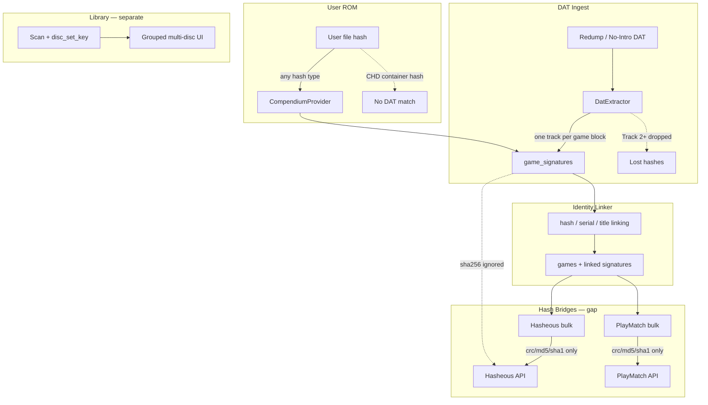

# Compendium Multi-Disc Hashes & SHA256 Bridges — Research Report

**Date:** 2026-06-18  
**Context:** Follow-up to the compendium build investigation (post `e937f9d`). Two items were
deferred as P3/nice-to-have: **multi-disc hash ingest** and **SHA256 hash bridges**. This
document captures codebase analysis, industry practice, and a recommended implementation path.

**Related docs:**

- [COMPENDIUM-DATA-SOURCES.md](COMPENDIUM-DATA-SOURCES.md) — source inventory and bridge overview
- [compendium-completeness-plan-2026-05-26.md](../plans/compendium-completeness-plan-2026-05-26.md) — Hasheous API notes
- Library multi-disc UX — implemented separately via `files.disc_set_key` / `disc_number` (not compendium)

---

## Executive summary

The deferred items are **not** the same problem:

| Deferred item | Root cause | User impact |
|---------------|------------|-------------|
| **Multi-disc hashes** | `DatExtractor` keeps one data track per DAT `game` block; Track 02+ hashes never reach `game_signatures` | PS1/Saturn/Mega CD users matching on non-primary tracks miss the compendium |
| **SHA256 bridges** | Ingest and `CompendiumProvider` lookup support sha256; bulk Hasheous/PlayMatch/RA passes and Hasheous runtime do not | Newer No-Intro/digital sets with sha256-heavy identity get no bridge enrichment |

**Library multi-disc grouping** (e.g. three FF7 zip files under one collapsible heading) is
**already solved** at scan time. This report covers **compendium identity** only.

**Highest-value next steps:**

1. **Tier 1** — Add sha256 to bulk bridge hash loading; modernize Hasheous API payload.
2. **Tier 2** — Ingest all data-track ROM rows per game block (not only Track 01).
3. **Defer Tier 4** — CHD/RVZ matching belongs at library scan time; ecosystem DAT support is immature.

---

## 1. What was deferred (original investigation)

From the second compendium build investigation:

### 1.1 Multi-disc DAT collapse drops alternate hashes

> `compendium_dat_extractor.cpp` keeps one canonical ROM per `gameName` (strips `.cue`/`.m3u`
> tracks). Secondary disc hashes are never ingested — hurts multi-disc Hasheous/PlayMatch matching.

### 1.2 SHA256 stored but not bridged

> **sha256** — Stored in signatures; no enrichment pass matches on sha256.

---

## 2. Multi-disc hashes — three distinct problems

These are often conflated. Remus handles them differently.

### 2.1 Library display grouping — done

The GUI/library pipeline groups multi-disc files at scan time:

- `files.disc_set_key`, `files.disc_number`
- `DiscSetUtils`, `M3UGenerator`, `WorkflowController` collapsible rows
- Match-aware reconciliation on confirm

This is **orthogonal** to compendium ingest. A user can see FF7 as one grouped set in the
library while the compendium may still have incomplete track-level hash coverage.

### 2.2 Multi-disc as separate DAT entries — mostly works

Redump and No-Intro model each **disc** as its own `game` block:

```
game ( name "Final Fantasy VII (USA) (Disc 1)" ... )
game ( name "Final Fantasy VII (USA) (Disc 2)" ... )
game ( name "Final Fantasy VII (USA) (Disc 3)" ... )
```

Each block produces its own `SourceRecordEnvelope` with its primary track hash.

The identity linker strips disc suffixes when normalizing titles
(`compendium_identity_linker.cpp`), so Disc 1–3 typically **merge to one `game_id`** with
**multiple signatures** — correct for metadata (one IGDB game) and for matching any disc hash
**if that disc was ingested**.

**Industry reference:** Redump treats each disc as a physically unique medium with its own
hashes. Multi-disc play is handled at the library layer (M3U), not by collapsing discs in the
hash database.

- [Redump Mega CD DAT example](https://github.com/libretro/libretro-database/blob/master/metadat/redump/Sega%20-%20Mega-CD%20-%20Sega%20CD.dat)
- [Redump Dreamcast DAT example](https://github.com/libretro/libretro-database/blob/master/metadat/redump/Sega%20-%20Dreamcast.dat)

### 2.3 Multi-track within one disc — real compendium gap

Redump CD games often have **one `game` block with many `rom` rows** (`.cue` + Track 01…N).
`DatExtractor` collapses that to a single canonical track:

```cpp
// src/metadata/compendium_dat_extractor.cpp
// Group entries by gameName and select the canonical data-track per game.
for (auto it = groups.cbegin(), end = groups.cend(); it != end; ++it)
    canonical.append(it->size() == 1 ? it->first() : selectDataTrack(*it));
```

`selectDataTrack` returns the **first non-meta** file (`.cue`, `.m3u`, `.gdi`, etc. are
skipped). For a typical Redump entry that is **Track 01**. Hashes for Track 02+ never reach
`game_signatures`.

**Impact:** A ROM that verifies against Track 3's CRC/MD5/SHA1 will not match the compendium,
even though Redump lists that track.

**Test coverage today:** `test_compendium_dat_extractor.cpp::extractSelectsDataTrack` only
asserts cue-vs-bin selection within one game block — not multi-track loss.

**Shared-track caveat:** Redump sets sometimes share identical track files across unrelated
titles (e.g. Saturn audio tracks). Hash linking is exact (`UNIQUE(hash_type, hash_value)`),
so a shared track hash correctly resolves to whichever game ingested it first — this is
expected Redump/ClrMamePro behavior, not a Remus-specific bug.

- [Retool discussion on shared Redump tracks](https://github.com/unexpectedpanda/retool/discussions/318)

---

## 3. SHA256 bridges — current Remus state

### 3.1 Layer-by-layer support

| Layer | SHA256 support | Location |
|-------|----------------|----------|
| DAT ingest | Yes | `compendium_dat_extractor.cpp` — stores when DAT provides it |
| `game_signatures` | Yes | `compendium_fact_inserter.cpp` |
| Identity linker | Yes — highest hash priority | `compendium_identity_linker.cpp` Pass 0 |
| `CompendiumProvider::getByHash` | Yes — 64-char hex | `compendium_provider.cpp` |
| Hasheous runtime `getByHash` | **No** — only 8/32/40 chars | `hasheous_provider.cpp` |
| Hasheous bulk enrich | **No** — `IN ('md5','sha1','crc32')` | `compendium_enrichment_hasheous.cpp` |
| PlayMatch bulk enrich | **No** — same SQL filter; passes empty sha256 | `compendium_enrichment_playmatch.cpp` |
| RA bulk enrich | **No** — md5/sha1/crc only | `compendium_enrichment_ra.cpp` |
| `HashAlgorithms::detectFromLength` | **No** sha256 | `hash_algorithms.h` (8/32/40 only) |

**Gap summary:** SHA256 is a **lookup** format in the compendium DB, but not a **bridge**
format for API enrichment or Hasheous runtime.

### 3.2 PlayMatch runtime vs bulk

Runtime `identifyBySignals` accepts sha256 as a query parameter:

```cpp
// src/metadata/playmatch_provider.cpp
if (!sha256Hash.isEmpty() && isHexHash(sha256Hash, 64))
    params.addQueryItem(QStringLiteral("sha256"), sha256Hash);
```

Bulk compendium enrichment hardcodes an empty sha256 argument:

```cpp
// src/cli/compendium_enrichment_playmatch.cpp
provider.identifyBySignals(game.title, game.fileSize, game.crc32, game.md5, game.sha1, QString(), QString());
```

### 3.3 Hasheous API — legacy vs evolving

Remus today posts a **single-object** body with camelCase keys (`mD5`, `shA1`) to
`POST /api/v1/Lookup/ByHash`.

**Ecosystem changes (June 2026):**

- RomM [PR #3498](https://github.com/rommapp/romm/pull/3498) migrated to an **array payload**
  (one hash object per qualifying top-level file), lowercase keys (`md5`, `sha1`, `crc`), and
  CHD-specific handling (`chd_sha1_hash` sends only `sha1`).
- Hasheous documents per-hash GET routes including `/sha256/{sha256}` and MCP tool
  `hasheous_lookup_hashes` (CRC/MD5/SHA1/SHA256).
- See [compendium-completeness-plan-2026-05-26.md](../plans/compendium-completeness-plan-2026-05-26.md).

**No-Intro:** SHA-256 is a first-class field in their file convention — increasingly relevant
for newer and digital sets.

- [No-Intro file convention](https://wiki.no-intro.org/index.php?title=File_Convention)

---

## 4. CHD / RVZ — related but separate from compendium ingest

Compressed container formats are the main real-world pain point behind "sha256 bridge" requests,
but they are **not solved by compendium DAT ingest alone**.

### 4.1 The mismatch

| Format | What DATs index | What users often store |
|--------|-----------------|------------------------|
| Redump CD | Per-track `.bin` CRC/MD5/SHA1 | `.chd` with header/content hashes |
| Redump DVD | `.iso` hashes | `.chd` or `.rvz` |
| No-Intro | Raw dump hashes | Various containers |

Container file hashes ≠ Redump track hashes. Decompressing on every lookup is impractical for
bulk compendium builds.

### 4.2 Ecosystem status (as of mid-2026)

- [RomM #2241](https://github.com/rommapp/romm/issues/2241): metadata agents index
  **uncompressed Redump hashes**; PlayMatch and Hasheous plan CHD/RVZ support but have not
  shipped it broadly.
- RomM maintainers: building CHD-specific DATs is easier than on-the-fly decompression.
- RomM 4.9 direction: store **CHD header SHA1** separately from raw file hash at scan time.
- Community analysis: CHD "Data SHA1" works cleanly for single-track DVD ISOs; **multi-track
  CD CHDs are hit-or-miss** because Redump verifies per-track bins while CHD stores one content
  hash.

### 4.3 Implication for Remus

- **Compendium:** Keep indexing Redump/No-Intro raw hashes from DATs.
- **Library scan:** Future work — extract CHD header hashes at scan time (RomM 4.9 pattern).
- **Bridges:** Wait for Hasheous/PlayMatch to index CHD hashes reliably before investing in
  compendium-side CHD bridging.

---

## 5. Architecture



---

## 6. Recommended implementation path

### Tier 1 — SHA256 in bridges (low effort, ~1–2 days)

| Task | Files | Notes |
|------|-------|-------|
| Load `sha256` in bulk hash SQL | `compendium_enrichment_hasheous.cpp`, `compendium_enrichment_playmatch.cpp`, `compendium_enrichment_ra.cpp` | Add to `hash_type IN (...)` |
| Pass sha256 to PlayMatch | `compendium_enrichment_playmatch.cpp` | Wire `game.sha256` into `identifyBySignals` |
| Hasheous runtime sha256 | `hasheous_provider.cpp` | Accept 64-char hash; extend `getByHashes` POST body |
| Hasheous API modernization | `hasheous_provider.cpp` | Consider array payload + lowercase keys per RomM #3498 |
| Optional: `HashAlgorithms` | `hash_algorithms.h` | Add SHA256_LENGTH=64 for consistency |

No schema migration. Improves enrichment for Wii U, Switch, and newer No-Intro sets.

### Tier 2 — Multi-track signature coverage (~3–5 days)

| Task | Notes |
|------|-------|
| Emit one envelope per **data track** in `DatExtractor` | Skip meta extensions only; do not collapse to `selectDataTrack` |
| Identity linker attaches all tracks to same `game_id` | Hash link within ingest batch; title/serial link for same game block |
| Respect `UNIQUE(hash_type, hash_value)` | Each track hash is unique; multiple rows per `game_id` already supported |
| Tests | Multi-track fixture in `test_compendium_dat_extractor.cpp` |

**Do not** merge separate disc DAT entries into one envelope — Redump treats discs as distinct
verifiable units.

### Tier 3 — Compendium disc-set model (optional, larger)

If compendium-native multi-disc queries are needed beyond title merge:

| Approach | Pros | Cons |
|----------|------|------|
| `game_discs` table (`game_id`, `disc_number`, `signature_id`) | Clean per-disc queries | New schema + merge rules |
| `disc_number` on `game_signatures` | Minimal schema change | Harder to query full disc sets |
| Title merge only (current) | No work | No explicit disc index |

For most Remus use cases, **Tier 2 + title merge** is sufficient before a `game_discs` table.

### Tier 4 — CHD/RVZ at library scan (defer)

| Task | Layer | Notes |
|------|-------|-------|
| CHD header SHA1 / data SHA1 extraction | Library scan / verification | RomM 4.9 pattern |
| Store alongside raw file hash | `files` table or verification metadata | Enables runtime bridge lookup |
| Compendium CHD DAT ingest | Deferred | Depends on Hasheous/PlayMatch indexing |

---

## 7. What not to do yet

- **Do not merge all discs into one DAT envelope** — loses disc-specific hashes.
- **Do not prioritize compendium sha256 work primarily for CHD users** — compendium only
  knows Redump raw hashes until scan-time CHD extraction exists.
- **Do not block on Hasheous CHD API reliability** — community reports (mid-2026) show misses
  even when listing pages display CHD hashes ([RomM #2241](https://github.com/rommapp/romm/issues/2241)).

---

## 8. Priority matrix

| Priority | Work item | User-visible benefit |
|----------|-----------|---------------------|
| **P1** | SHA256 in bulk bridges + Hasheous API modernization | Better enrichment for sha256-heavy DATs |
| **P2** | Ingest all data-track hashes per game block | PS1/Saturn/Mega CD track-level matching |
| **P3** | Explicit `game_discs` in compendium | Per-disc metadata, disc-aware provider queries |
| **P4** | CHD header hashing at library scan | CHD users match without decompressing |

---

## 9. Key source references

### Remus code

| Topic | Path |
|-------|------|
| DAT track collapse | `src/metadata/compendium_dat_extractor.cpp` |
| Title/disc normalization | `src/metadata/compendium_identity_linker.cpp` |
| Signature insert | `src/metadata/compendium_fact_inserter.cpp` |
| Compendium hash lookup | `src/metadata/compendium_provider.cpp`, `compendium_provider_lookup.cpp` |
| Hasheous bulk enrich | `src/cli/compendium_enrichment_hasheous.cpp` |
| PlayMatch bulk enrich | `src/cli/compendium_enrichment_playmatch.cpp` |
| Hasheous runtime | `src/metadata/hasheous_provider.cpp` |
| PlayMatch runtime | `src/metadata/playmatch_provider.cpp` |
| Library disc sets | `src/core/disc_set_utils.cpp`, `src/services/library_service.cpp` |
| Schema | `data/compendium/migrations/0001_phase1_canonical_schema.sql` |

### External

| Topic | URL |
|-------|-----|
| Hasheous project | https://github.com/gaseous-project/hasheous |
| Hasheous Swagger | https://hasheous.org/swagger/index.html |
| PlayMatch | https://github.com/RetroRealm/playmatch |
| RomM Hasheous array payload | https://github.com/rommapp/romm/pull/3498 |
| RomM CHD/RVZ feature request | https://github.com/rommapp/romm/issues/2241 |
| No-Intro SHA-256 field | https://wiki.no-intro.org/index.php?title=File_Convention |
| CHD format notes | https://wiki.romcenter.com/wiki/doku.php?id=chd |
| RomM metadata providers | https://docs.romm.app/latest/Getting-Started/Metadata-Providers/ |

---

## 10. Open questions

1. **Hasheous array API** — When to migrate Remus from single-object camelCase to list payload?
   Backward compatibility window unclear; RomM merged June 2026.
2. **Per-disc metadata** — Do any enrichment sources return disc-specific descriptions, or is
   game-level metadata always sufficient once discs share one `game_id`?
3. **CHD DAT authority** — Is MAME Redump CHD the canonical DAT for CHD verification, and is
   Hasheous indexing it consistently?
4. **Shared track policy** — Should compendium validation warn when one track hash maps to
   multiple unrelated `game_id` values across systems?

**See also:** [COMPENDIUM-BUILD-DEEP-RESEARCH.md](COMPENDIUM-BUILD-DEEP-RESEARCH.md) — full
pipeline audit, industry context, validation gaps, and unified P0–P3 roadmap.

---

*Generated from codebase review and external research, 2026-06-18.*
