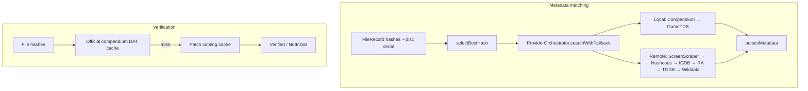

# ROM matching audit — accuracy order and gaps

> **Status:** Active audit (2026-06-10)  
> **Scope:** Metadata matching (`--match`, GUI) and verification (`VerificationEngine`)  
> **Related:** [COMPENDIUM-DATA-SOURCES.md](COMPENDIUM-DATA-SOURCES.md) · [metadata-providers.md](../metadata-providers.md) · [compendium-first-matching.md](../archive/plans/compendium-first-matching.md)

Reference for how Remus identifies ROMs today, whether signals are tried in the
correct accuracy order, and what to add for unmatched files.

---

## Executive summary

Remus runs **two separate matching pipelines** that do not share the same logic:

| Pipeline | Entry point | Purpose |
|----------|-------------|---------|
| **Metadata matching** | `--match`, GUI match controller | Identify game + persist metadata |
| **Verification** | `VerificationEngine::verifyFile` | Confirm ROM against official/patch catalogs |

The strongest offline signals (compendium multi-hash, serial, patch catalog,
multi-signal corroboration) are **not all exercised** in the main `--match` path.
The richest offline multi-signal logic (`LocalDatabaseProvider::matchROM`) exists
but is **not registered** in the default CLI orchestrator.

**Highest-accuracy path for unmatched ROMs (target state):**

```text
multi-hash compendium → serial (disc) → patch catalog → Hasheous/PlayMatch
→ guarded filename+size → FTS name with system/region → manual confirm
```

---

## 1. Two pipelines



**Key code paths**

| Component | File |
|-----------|------|
| Orchestrator fallback | `src/metadata/provider_orchestrator_fallback.cpp` |
| Provider registration (CLI) | `src/cli/cli_helpers_providers.cpp` |
| Match command | `src/cli/cli_commands_match.cpp` |
| Hash selection | `src/core/match_utils.cpp` |
| Compendium hash/serial | `src/metadata/compendium_provider_lookup.cpp` |
| Verification | `src/core/verification_engine_verify.cpp` |
| Multi-signal (legacy) | `src/metadata/local_database_provider_match.cpp` |
| Provider priorities | `src/core/constants/providers.h` |

---

## 2. Canonical accuracy ladder

Signals ranked from most to least accurate for **identity** (not enrichment):

| Rank | Signal | Confidence | Compendium | `--match` | Verification |
|------|--------|------------|------------|-----------|--------------|
| 1 | Cryptographic hash (SHA256 → SHA1 → MD5 → CRC32, system-preferred first) | Definitive | Yes (`game_signatures`) | Partial | Yes |
| 2 | Disc/product serial (IP.BIN, etc.) | Very high (disc) | Yes (`game_serials`) | After hash per provider | No |
| 3 | Patch/hack hash (libretro hacks, translations) | Definitive (patched ROM) | Yes (`patch_entries`) | **No** | Yes (after official miss) |
| 4 | Multi-hash online lookup (Hasheous: CRC+MD5+SHA1 POST) | High | N/A | Hasheous only | No |
| 5 | Authenticated hash APIs (ScreenScraper, PlayMatch) | High | N/A | ScreenScraper only | No |
| 6 | Hash + file size corroboration | High | Partial | **No** | No |
| 7 | Filename + size (exact base + ±1 KiB) | Medium (~40–80%) | No | **No** | No |
| 8 | Serial-only (no hash) | Medium (~65%) | Yes | Compendium only | No |
| 9 | Structured name (FTS / normalized title) | Medium–low | Yes | Last resort per provider | No |
| 10 | Fuzzy name (TGDB, IGDB, Wikidata) | Low | N/A | Yes | No |

---

## 3. Current `--match` execution order

Wiring: `buildOrchestrator()` in `src/cli/cli_helpers_providers.cpp`.

**`LocalDatabaseProvider` is not registered.** Multi-signal `matchROM()` is unused
in production match (see `docs/metadata-providers.md`).

### Phase A — local providers (priority descending)

| Order | Provider | Priority | Hash | Serial | Name |
|-------|----------|----------|------|--------|------|
| 1 | Compendium | 210 | Single hash via `getByHash` | Yes | FTS/LIKE |
| 2 | GameTDB | 150 | Single hash (index by digest length) | No | Yes |

### Phase B — remote providers

Only if identity not resolved (hash match score ≥ 1.0 stops the waterfall
unless artwork is required).

| Order | Provider | Priority | Hash behaviour |
|-------|----------|----------|----------------|
| 1 | ScreenScraper | 90 | One hash type per API request |
| 2 | Hasheous | 80 | All CRC+MD5+SHA1 in one POST |
| 3 | IGDB | 70 | Name only |
| 4 | RetroAchievements | 60 | MD5-oriented API hash |
| 5 | TheGamesDB | 50 | Name only |
| 6 | Wikidata | 40 | Name only |

### Per-provider attempt order (`queryProvider`)

For each provider, in order:

1. **Hash** — `getByHash(selectBestHash(file), …)`  
   Exception: Hasheous uses `getByHashes(crc32, md5, sha1)`.
2. **Serial** — `getBySerial(discSerial)` when extracted.
3. **Name** — normalized filename search.

---

## 4. Verification pipeline

`VerificationEngine::verifyFile`:

1. Require calculated hashes.
2. **Official catalog** — compendium `game_signatures` via DAT cache;  
   `findOfficialDatMatch` uses SHA256-first cascade.
3. **Patch catalog** — `findPatchCatalogMatch` (libretro hacks DATs).
4. Else → `NotInDat`.

**Not used in verification:** serial-only, filename+size, name search, Hasheous,
online APIs. That is appropriate for integrity checking; a disc matched by serial
in `--match` can still show `NotInDat` in verify if no hash is in catalog.

---

## 5. Identified gaps

### Critical

| ID | Issue | Impact |
|----|--------|--------|
| **G1** | Single-hash compendium lookup — only `selectBestHash` passed to `getByHash` | Miss when preferred hash empty or catalog keyed on different digest |
| **G2** | No SHA256 in `CompendiumProvider::detectHashType` (stops at 40-char SHA1) | CHD/MAME-style SHA256 signatures invisible to compendium lookup |
| **G3** | Multi-signal matching not in orchestrator (`LocalDatabaseProvider::matchROM`) | Unhashed/partial dumps fail earlier than necessary |
| **G4** | Patch catalog excluded from metadata match | Translations/hacks verify but may not get metadata via `--match` |
| **G5** | Remote hash order: ScreenScraper (90) before Hasheous (80) | SS may fail when Hasheous multi-hash would succeed |
| **G6** | PlayMatch referenced in `detectHashSupport` but not implemented | No second hash→IGDB bridge (RomM-style) |
| **G7** | Compendium-first two-pass + `enrichMissingFields` not wired in `searchWithFallback` | Redundant provider calls; planned in [compendium-first-matching.md](../archive/plans/compendium-first-matching.md) |

### Moderate

| ID | Issue | Impact |
|----|--------|--------|
| **G8** | Hash order inconsistency across subsystems | Same ROM can verify but fail match (or vice versa) |
| **G9** | RA hash ≠ No-Intro MD5 on several systems | RA provider false-negative when compendium/Hasheous match |
| **G10** | No runtime size check after compendium hash hit | Theoretical collision not filtered at match time |
| **G11** | GameTDB checks indexes by digest length, but orchestrator passes one hash | Better than compendium single-type query, still not multi-field |

### Documentation drift

`docs/metadata-providers.md` lists providers in registration order, not
local-then-remote execution order, and omits that GameTDB runs before any online
provider.

---

## 6. Unmatched ROMs — enrichment options

For ROMs that fail compendium hash and online hash lookup.

### Tier A — compendium / orchestrator (high ROI)

| Approach | Precedent | Remus fit |
|----------|-----------|-----------|
| Multi-hash cascade in compendium lookup | Igir, Hasheous | Extend `CompendiumProvider` or pass all digests like Hasheous |
| SHA256 in `detectHashType` | MAME listxml, CHD | Small change in `compendium_provider.cpp` |
| Patch catalog in metadata match | libretro `metadat/hacks` (imported) | Query `patch_entries` after official miss |
| Serial-first for disc systems | RetroArch/Libretro disc key field | Reorder `queryProvider` when serial present |
| Multi-signal offline pass | Existing `matchROM` | Port to compendium-backed matcher or re-register provider |
| Compendium-first + gap enrichment | Planned architecture | See compendium-first-matching plan |

### Tier B — new catalog sources

See [COMPENDIUM-DATA-SOURCES.md](COMPENDIUM-DATA-SOURCES.md) for URLs and import paths.

| Source | Use |
|--------|-----|
| Hasheous bulk gap-fill | Unmatched signatures → IGDB ID |
| PlayMatch | Hash→IGDB when IGDB creds present |
| TOSEC | Broader coverage; Hasheous indexes TOSEC |
| libretro homebrew / libretro-dats | Fan translations, FDS extras |
| No-Intro non-Redump | Hacks/translations beyond libretro hacks |
| Lost Level DAT | RA supplementary hash sets |
| RAPatches | Patched-ROM identity for RA-linked hashes |

### Tier C — weak signals (guardrails required)

| Signal | When useful | Risk |
|--------|-------------|------|
| Filename + size (±1 KiB) | Unheadered dumps | Collisions on common sizes |
| Normalized title FTS | Scene/renamed folders | Region/revision ambiguity |
| Fuzzy name + system + year | No hash in any DAT | False positives without confirm |
| CHD header SHA1 only | CHD without full track hash | DAT may expect BIN/CUE hashes |
| RA-specific hash (RAHasher) | Achievement context | Must not mix with No-Intro MD5 |

### Tier D — human-in-the-loop

Manual match, `game_names` aliases, dedup merge — safe fallback when automated
confidence is below threshold (default 60% in `--match`).

---

## 7. Target unified identity order

Proposed metadata identity waterfall for a future refactor:

```text
1.  Cache hit (same hash + system)
2.  Compendium — ALL file hashes (sha256 → sha1 → md5 → crc32, system preferred first)
3.  Compendium — serial (disc systems, if serial extracted)
4.  Compendium — patch_entries hash cascade
5.  Compendium — multi-signal (hash+size, filename+size, serial+size) with confidence scoring
6.  GameTDB — all hashes (Nintendo/PS3 only)
7.  Hasheous — multi-hash POST
8.  ScreenScraper — hash (if creds)
9.  PlayMatch — multi-hash (if implemented + creds)
10. RetroAchievements — MD5 API hash (achievement context; not primary identity)
11. Compendium / remote — FTS name with system filter
12. IGDB / TGDB / Wikidata — normalized name (enrichment-weighted scores)
13. Manual / user confirm
```

Verification stays strict: **official hash → patch hash → NotInDat** (no name fallback).

---

## 8. Remediation roadmap

| Priority | Change | Fixes | Effort |
|----------|--------|-------|--------|
| P1 | Compendium tries all file hashes (incl. SHA256) | G1, G2 | Small |
| P2 | Patch catalog lookup in orchestrator / compendium provider | G4 | Small |
| P3 | Hasheous before ScreenScraper for hash identity | G5 | Small |
| P4 | Compendium-first two-pass + `enrichMissingFields` | G7 | Medium — see plan |
| P5 | Port `matchROM` signals to compendium-backed offline matcher | G3 | Medium |
| P6 | PlayMatch provider + bulk Hasheous compendium pass | G6, Tier B | Large |
| P7 | Align verification vs match hash cascade documentation | G8 | Small (docs + optional unify) |

---

## 9. Verification checklist

After implementing changes, re-run:

```bash
# Unit tests
ctest --test-dir build -R 'compendium|orchestrator|multi_signal'

# Offline hash match (compendium)
build/remus-cli --metadata <known_md5> --provider compendium

# Full match pass
build/remus-cli --match --library /path/to/roms

# Verification + patch catalog
build/remus-cli --verify --system NES
bash .github/scripts/validate-compendium-db.sh data/compendium/remus_compendium.db \
  data/compendium/validation/0002_phase2_quality_checks.sql
```

---

## 10. Change log

| Date | Change |
|------|--------|
| 2026-06-10 | Initial audit — dual pipeline analysis, gap register (G1–G11), remediation roadmap |
