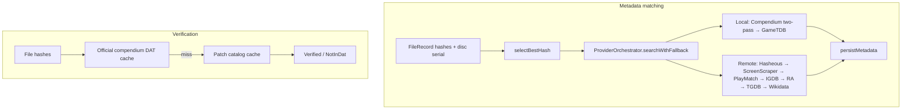

# ROM matching audit — accuracy order and gaps

> **Status:** Active audit — remediation P1–P7 complete (2026-06-10)  
> **Scope:** Metadata matching (`--match`, GUI) and verification (`VerificationEngine`)  
> **Related:** [COMPENDIUM-DATA-SOURCES.md](COMPENDIUM-DATA-SOURCES.md) · [metadata-providers.md](../metadata-providers.md) · [compendium-first-matching.md](../archive/plans/compendium-first-matching.md)

Reference for how Remus identifies ROMs today, whether signals are tried in the
correct accuracy order, and what to add for unmatched files.

---

## Executive summary

Remus runs **two matching pipelines** with different goals but a **shared hash cascade**
for offline catalog lookups:

| Pipeline | Entry point | Purpose |
|----------|-------------|---------|
| **Metadata matching** | `--match`, GUI match controller | Identify game + persist metadata |
| **Verification** | `VerificationEngine::verifyFile` | Confirm ROM against official/patch catalogs |

Both pipelines now try digests in the same order for compendium official signatures
and patch entries (see [§2.1 Canonical hash cascade](#21-canonical-hash-cascade)).
Metadata matching adds serial, multi-signal, and online provider fallbacks that
verification intentionally excludes.

**Current highest-accuracy metadata identity path:**

```text
compendium multi-hash → serial → patch catalog (via cascade) → compendium multi-signal
→ GameTDB multi-hash → Hasheous → ScreenScraper → PlayMatch → RA → name providers
```

---

## 1. Two pipelines



**Key code paths**

| Component | File |
|-----------|------|
| Orchestrator fallback | `src/metadata/provider_orchestrator_fallback.cpp` |
| Provider registration (CLI) | `src/cli/cli_helpers_providers.cpp` |
| Match command | `src/cli/cli_commands_match.cpp` |
| Hash selection (cache key) | `src/core/match_utils.cpp` (`selectBestMatchHash`) |
| Hash cascade (shared) | `src/core/verification_hash_matcher.cpp` |
| Match hash ordering | `src/core/match_utils.cpp` (`orderedMatchHashValues`) |
| Compendium hash/serial | `src/metadata/compendium_provider_lookup.cpp` |
| Verification | `src/core/verification_engine_verify.cpp` |
| Multi-signal (legacy) | `src/metadata/local_database_provider_match.cpp` |
| Provider priorities | `src/core/constants/providers.h` |

---

## 2. Canonical accuracy ladder

Signals ranked from most to least accurate for **identity** (not enrichment):

| Rank | Signal | Confidence | Compendium | `--match` | Verification |
|------|--------|------------|------------|-----------|--------------|
| 1 | Cryptographic hash (SHA256 → preferred → SHA1 → MD5 → CRC32) | Definitive | Yes (`game_signatures`) | Yes (cascade) | Yes |
| 2 | Disc/product serial (IP.BIN, etc.) | Very high (disc) | Yes (`game_serials`) | Yes (after hash per provider) | No |
| 3 | Patch/hack hash (libretro hacks, translations) | Definitive (patched ROM) | Yes (`patch_entries`) | Yes (cascade miss) | Yes (same cascade) |
| 4 | Multi-hash online lookup (Hasheous: CRC+MD5+SHA1 POST) | High | N/A | Yes (Hasheous) | No |
| 5 | Hash APIs (ScreenScraper, PlayMatch) | High | N/A | Yes | No |
| 6 | Multi-signal offline (hash+size, filename+size, serial) | Medium–high | Yes (`matchROM`) | Yes (compendium) | No |
| 7 | GameTDB multi-hash (Nintendo/PS3) | High | N/A | Yes (`getByHashes`) | No |
| 8 | Structured name (FTS / normalized title) | Medium–low | Yes | Last resort per provider | No |
| 9 | Fuzzy name (TGDB, IGDB, Wikidata) | Low | N/A | Yes | No |

### 2.1 Canonical hash cascade

Single source of truth: `VerificationHashMatcher::orderedOfficialHashTypes()` in
`src/core/verification_hash_matcher.cpp`.

**Try order** (each digest type at most once):

```text
sha256 → <system preferred> → sha1 → md5 → crc32
```

**Consumers**

| Subsystem | Function | Notes |
|-----------|----------|-------|
| Verification — official DAT | `findOfficialDatMatch` | Compendium `game_signatures` cache |
| Verification — patch catalog | `findPatchCatalogMatch` | Same cascade (aligned in P7) |
| Metadata — compendium / GameTDB | `orderedMatchHashValues` / `getByHashes` | Compendium also corroborates catalog `size` when `fileSize` is known |
| Metadata — cache key only | `selectBestHash` / `selectBestMatchHash` | One digest for cache keys; does **not** limit lookup |

`selectBestHash` is a convenience for cache keys and logging. The orchestrator passes
all calculated digests into `lookupByHashCascade`, so a ROM can verify and match on
the same hash even when the system-preferred type is empty.

---

## 3. Current `--match` execution order

Wiring: `buildOrchestrator()` in `src/cli/cli_helpers_providers.cpp`.
Search: `ProviderOrchestrator::searchWithFallback()` in `provider_orchestrator_fallback.cpp`.

**Pass 1 — compendium identity + gap enrichment**, then **Pass 2 — legacy waterfall**
for remaining gaps. `LocalDatabaseProvider` is not registered; compendium-backed
`matchROM()` covers the same multi-signal signals (P5).

### Phase A — local providers (priority descending)

| Order | Provider | Priority | Hash | Serial | Multi-signal | Name |
|-------|----------|----------|------|--------|--------------|------|
| 1 | Compendium | 210 | Multi-hash cascade + patch fallback | Yes | Yes | FTS/LIKE |
| 2 | GameTDB | 150 | Multi-hash cascade | No | No | Yes |

### Phase B — remote providers

Hash identity stops the waterfall at score ≥ 1.0 unless artwork is still required.

| Order | Provider | Priority | Hash behaviour |
|-------|----------|----------|----------------|
| 1 | Hasheous | 91 | CRC+MD5+SHA1 POST |
| 2 | ScreenScraper | 89 | One hash type per request (if creds) |
| 3 | PlayMatch | 88 | Identify API (fileName+size+hashes) |
| 4 | IGDB | 70 | Name only |
| 5 | RetroAchievements | 60 | MD5-oriented API hash |
| 6 | TheGamesDB | 50 | Name only |
| 7 | Wikidata | 40 | Name only |

### Per-provider attempt order (`queryProvider`)

For each provider, in order:

1. **Hash** — multi-hash cascade for compendium/GameTDB; Hasheous `getByHashes`;
   PlayMatch `identifyBySignals` when fileName and fileSize are available.
2. **Serial** — `getBySerial(discSerial)` when extracted.
3. **Multi-signal** — compendium `matchROM()` when hash/serial miss (P5).
4. **Name** — normalized filename search.

---

## 4. Verification pipeline

`VerificationEngine::verifyFile`:

1. Require calculated hashes.
2. **Official catalog** — compendium `game_signatures` via DAT cache;  
   `findOfficialDatMatch` uses the [canonical hash cascade](#21-canonical-hash-cascade).
3. **Patch catalog** — `findPatchCatalogMatch` uses the **same cascade** (not a fixed
   sha256→crc32 list).
4. Else → `NotInDat`.

**Not used in verification:** serial-only, filename+size, name search, Hasheous,
online APIs. That is appropriate for integrity checking; a disc matched by serial
in `--match` can still show `NotInDat` in verify if no hash is in catalog.

---

## 5. Gap register

### Resolved (P1–P7)

| ID | Issue | Resolution |
|----|--------|------------|
| **G1** | Single-hash compendium lookup | P1 — `lookupByHashCascade` tries all digests |
| **G2** | SHA256 invisible to compendium | P1 — SHA256 in `detectHashType` + cascade |
| **G3** | Multi-signal not in orchestrator | P5 — compendium `matchROM()` wired |
| **G4** | Patch catalog excluded from match | P2 — `lookupPatchByHash` on official miss |
| **G5** | ScreenScraper before Hasheous | P3 — priorities 91 / 89 |
| **G6** | PlayMatch not implemented | P6 — `PlayMatchProvider` |
| **G7** | Compendium-first two-pass missing | P4 — `searchWithFallback` two-pass |
| **G8** | Hash order inconsistency | P7 — shared `VerificationHashMatcher` cascade; patch aligned |

### Open

| ID | Issue | Status |
|----|--------|--------|
| **G9** | RA hash ≠ No-Intro MD5 on several systems | **Fixed** — `RaHasher` computes/stores `ra_md5`; orchestrator uses `raMd5` + `getById` shortcut; optional `REMUS_RAHASHER_PATH` for disc systems |
| **G10** | No runtime size check after compendium hash hit | **Fixed** — `CompendiumProvider::getByHash(..., fileSize)` rejects catalog size mismatches |
| **G11** | GameTDB internal index vs multi-hash pass | **Fixed** — `GameTDBProvider::getByHashes` uses verification-aligned cascade |

### Documentation

Provider execution order and hash cascade are documented in
[metadata-providers.md](../metadata-providers.md) and [§2.1](#21-canonical-hash-cascade) above.

---

## 6. Unmatched ROMs — enrichment options

For ROMs that fail compendium hash and online hash lookup.

### Tier A — compendium / orchestrator (high ROI)

| Approach | Precedent | Remus fit |
|----------|-----------|-----------|
| Multi-hash cascade in compendium lookup | Igir, Hasheous | Extend `CompendiumProvider` or pass all digests like Hasheous |
| SHA256 in `detectHashType` | MAME listxml, CHD | Small change in `compendium_provider.cpp` |
| Patch catalog in metadata match | libretro `metadat/hacks` (imported) | Query `patch_entries` after official miss |
| Serial-first for disc systems | RetroArch/Libretro disc key field | Reorder `queryProvider` when serial present |
| Multi-signal offline pass | Existing `matchROM` | Port to compendium-backed matcher or re-register provider |
| Compendium-first + gap enrichment | Planned architecture | See compendium-first-matching plan |

### Tier B — new catalog sources

See [COMPENDIUM-DATA-SOURCES.md](COMPENDIUM-DATA-SOURCES.md) for URLs and import paths.

| Source | Use |
|--------|-----|
| Hasheous bulk gap-fill | Unmatched signatures → IGDB ID |
| PlayMatch | Hash→IGDB when IGDB creds present |
| TOSEC | Broader coverage; Hasheous indexes TOSEC |
| libretro homebrew / libretro-dats | Fan translations, FDS extras |
| No-Intro non-Redump | Hacks/translations beyond libretro hacks |
| Lost Level DAT | RA supplementary hash sets |
| RAPatches | Patched-ROM identity for RA-linked hashes |

### Tier C — weak signals (guardrails required)

| Signal | When useful | Risk |
|--------|-------------|------|
| Filename + size (±1 KiB) | Unheadered dumps | Collisions on common sizes |
| Normalized title FTS | Scene/renamed folders | Region/revision ambiguity |
| Fuzzy name + system + year | No hash in any DAT | False positives without confirm |
| CHD header SHA1 only | CHD without full track hash | DAT may expect BIN/CUE hashes |
| RA-specific hash (RAHasher) | Achievement context | Must not mix with No-Intro MD5 |

### Tier D — human-in-the-loop

Manual match, `game_names` aliases, dedup merge — safe fallback when automated
confidence is below threshold (default 60% in `--match`).

---

## 7. Target unified identity order

Proposed metadata identity waterfall for a future refactor:

```text
1.  Cache hit (same hash + system)
2.  Compendium — ALL file hashes (sha256 → sha1 → md5 → crc32, system preferred first)
3.  Compendium — serial (disc systems, if serial extracted)
4.  Compendium — patch_entries hash cascade
5.  Compendium — multi-signal (hash+size, filename+size, serial+size) with confidence scoring
6.  GameTDB — all hashes (Nintendo/PS3 only)
7.  Hasheous — multi-hash POST
8.  ScreenScraper — hash (if creds)
9.  PlayMatch — multi-hash (if implemented + creds)
10. RetroAchievements — MD5 API hash (achievement context; not primary identity)
11. Compendium / remote — FTS name with system filter
12. IGDB / TGDB / Wikidata — normalized name (enrichment-weighted scores)
13. Manual / user confirm
```

Verification stays strict: **official hash → patch hash → NotInDat** (no name fallback).

---

## 8. Remediation roadmap

| Priority | Change | Fixes | Effort |
|----------|--------|-------|--------|
| P1 | Compendium tries all file hashes (incl. SHA256) | G1, G2 | Small |
| P2 | Patch catalog lookup in orchestrator / compendium provider | G4 | Small |
| P3 | Hasheous before ScreenScraper for hash identity | G5 | Small |
| P4 | Compendium-first two-pass + `enrichMissingFields` | G7 | Medium — see plan |
| P5 | Port `matchROM` signals to compendium-backed offline matcher | G3 | Medium |
| P6 | PlayMatch provider + bulk Hasheous compendium pass | G6, Tier B | **Done** |
| P7 | Align verification vs match hash cascade documentation | G8 | **Done** |

---

## 9. Verification checklist

After implementing changes, re-run:

```bash
# Unit tests
ctest --test-dir build -R 'compendium|orchestrator|multi_signal'

# Offline hash match (compendium)
build/remus-cli --metadata <known_md5> --provider compendium

# Full match pass
build/remus-cli --match --library /path/to/roms

# Verification + patch catalog (library against bundled compendium)
build/remus-cli --verify ~/roms/No-Intro_NES.dat --verify-report
bash .github/scripts/validate-compendium-db.sh data/compendium/remus_compendium.db \
  data/compendium/validation/0002_phase2_quality_checks.sql
```

---

## 10. Change log

| Date | Change |
|------|--------|
| 2026-06-10 | G9–G11 — RA MD5 wiring, compendium size corroboration, GameTDB getByHashes cascade |
| 2026-06-10 | P7 — shared hash cascade documented; patch verification uses `findHashInDatEntries` |
| 2026-06-10 | P1–P6 — multi-hash match, patch catalog, provider order, compendium-first, multi-signal, PlayMatch/Hasheous enrichment |
| 2026-06-10 | Initial audit — dual pipeline analysis, gap register (G1–G11), remediation roadmap |
